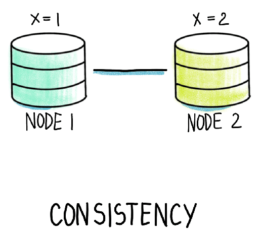

# MongoDB Kurulum ve Konfigürasyon (MongoDB Öğreniyoruz 1)

Merhaba arkadaşlar,

Bu yazı serimizde MongoDB'yi developer bakış açısıyla öğrenmeye çalışacağız. Bir developer olarak amacımız MongoDB'nin dolayısıyla document DB'lerin konseptini anlamak olacak. Temelde CRUD işlemlerini, aggregation operatörlerini (avg, sum, group by, ...vb), index mekanizması ve transaction kullanımını öğrenmeye çalışacağız.

Bu yazımızda ise aşağıdaki konu başlıklarına değineceğiz.

- CAP (kep diye okunur) ve PACELC (pass-elk diye okunur) Teoremi ve ACID prensibleri
- RDBMS ile document DB'ler arasındaki ayrıca document DB'lerin kendi aralarındaki farklar
- MongoDB ekosistemi
- MongoDB ve gerekli araçların kurulumu

Evet adettendir document db konuşacaksak CAP teoremi ve ACID prensiplerinden bahsetmemek olmaz. Dağınık yapılarda verinin tutarlılığı, uygunluğu (erişilebilirliği) ve hataya karşı dayanıklılığı üzerinde çokça tartışılan halen çalışmalar yapılan konu başlıkları. Veriyi dağıttığınızda bu üç problemle de ilgilenmek ve bazılarında taviz vermeniz gerekiyor.  

## CAP Teoremi

[resim kaynak](https://luminousmen.com/post/cap-and-pacelc-theorems-in-plain-english/)

CAP  Teoremi distributed (dağınık yapı) bir yapıda limitlerimiz nedir ve neyi seçersek nelerden feragat etmemiz gerekir bunu açıklamaya çalışmıştır.

- **Consistency**: En basit haliyle dağınık yapıdaki bütün sunuculardan (node'lardan) read işlemi yapıldığında en son yazma işleminin sonucu dönmelidir. (Okumada her sunucu aynı sonucu dönmelidir. Suncular arasında farklılık olmamalıdır.)

[resim kaynak](https://luminousmen.com/post/cap-and-pacelc-theorems-in-plain-english/)

- **Availability**: Her isteğin belli bir süre içinde hatasız bir cevap dönmesini ifade eder. Hatasızdan kasıt verinin hatasız olması değildir. Sistem hata vermeden sonuç dönmeli ancak read ederken dönen sonuç hatalı olabilir buna takılmıyoruz. Tabi mevzu sadece okuma değil yazmayı da yapabiliyor olmamız lazım. Ancak yazarsak sunucular arasında veri tutarsızlığı olacak ancak bu availability kavramının konusu değil o consistency ile ilgili bir durum.

[resim kaynak](https://luminousmen.com/post/cap-and-pacelc-theorems-in-plain-english/)

- **Partition Tolerance**: Sistem üzerinde belli orana kadar mesaj düşse dahi sistem çalışabilir durumda olmalıdır. Burada mesajın iletilememesinden kasıt bir cluster'da node'lardan bir veya birkaçı düştüğünde o node'larla olan iletişim kopacağından diğer node'ların mesaj iletemeyeceği veya alamayacağıdır. Bu durumda dahi sistemin ayakta cevap verebilir olması partition tolerant olduğunu gösterir. Burada tek baktığımız okuma değil yazmayı da yapabiliyor olmalıyız. Yani elimizdeki veri paçalara bölünüyor olmalı ve dağınık yapımız da network yapısı ve yetenekleri itibariyle bunu sağlayabilmelidir. Verimiz parçalara ayrılıp yazılmaya başladığında sunuculardan biri veya birkaçı sistemden düşse dahi yazmaya devam edebilmelidir. Yada sistemde var olan ve dağınık olarak yazılmış bir verinin  bir veya birkaç sunucu sistemden düşse dahi okunabiliyor olmasını ifade eder..

[resim kaynak](https://luminousmen.com/post/cap-and-pacelc-theorems-in-plain-english/)


Peki bu  teorem  tam olarak ne söylemeye çalışıyor onu anlamaya çalışalım. 

- Eğer bir sistem hem Consistent hem de  Partition Tolerant  (CP) ise Available (A) olamayacaktır. Çünkü sunuculardan biri sistemden düştüğü an artık diğer sunuculara yazdığımız verilerden haberdar olamayacaktır. Eğer yazmaya devam edersek sistemden kopan sunucu ile diğerleri arasında farklılık olacağından okumada problem yaşarız. Daha doğrusu yazma yapamayız ancak okuma yapabiliriz. Bu durumda yazma konusunda sistemin availability'si gitmiş oluyor. Sistemi ayakta tutmak için ilgili sunucuyu kapatmalı yada oraya hiç istek göndermemeliyiz. Böylece consistent ve partition tolerant bir sistem kurmuş oluruz.
- Eğer bir sistem hem Consistent hem de  Available ise (CA) Partition Tolerant (P) olamayacaktır. Çünkü sunuculardan biri sistemden koptuğu anda aslında en son yazdığımız veri kopan sunucuda da olacağından okuma kısmında problem yaşamayız. Ancak sisteme yazma yapmaya kalkarsak sistemden kopan sunucu sistemden verileri alamayacağı için partition tolerant bir sistem olmamış olacak. Available ve consistent bir sistem kurmak için partition tolerant sistemden feragat etmiş oluruz. 
- Eğer bir sistem hem Available hem de  Partition Tolerant (AP) ise Consistent (C) olamayacaktır. Çünkü sistemden bir veya birden fazla sunucu koptuğunda dahi sisteme yazabiliyor olmamamız ve hatalı dahi olsa bütün sunucuların cevap verebiliyor olması sistemin hem available hem de partition tolerant olduğunu gösterir ancak veriler consistent olamaz. Çünkü okuma yaptığımızda sistemden kopan sunuculardan hatalı veri gelmiş olur ki buda consistency'yi bozar. 

O zaman eğer partition tolerant bir sistem kurmak istiyorsak ya consistency yada availability'den ödün vermemiz gerekiyor. 


- Sistemden ayrılan sunucuların cevap vermesi (availability) engellenip kalan sunucularla hem yazma hem de okuma yapabiliriz bu birinci seçeneğimiz. Yani sistemin ayakta kalmasını bazı sunuculardan feragat edip sağlamış olduk. Böylece consistent ve partition tolerant bir sistem kurmuş olduk.
- Yada sistemden ayrılan sunucuları ayakta tutup onlara yazamazsak bile hatalı sonuç dönmelerine katlanıp sistemin availability'sini ayakta tutabiliriz. Bu durumda partition tolerant ve available bir sitem kurmuş olduk.  

## PACELC Teoremi

Daniel J. Abadi "[Consistency Tradeoffs in Modern Distributed Database System Design](https://www.cs.umd.edu/~abadi/papers/abadi-pacelc.pdf)" başlıklı makalesinde bu kısaltmayı kullanmıştır. PACELC kısaltmasının açılımı eğer bir sistemde Partition (P) varsa, sistem ya Available (A) yada Consistent'dir (C). Öteki türlü yani partition yoksa (Else kelimesinin E'si) sistem ya Latency'yi (L) yada Consistency'yi (C) tercih etmelidir.

O zaman kaşımıza şu seçenekler çıkıyor

- PAEL
- PAEC
- PCEL
- PCEC


[resim kaynak](https://designgurus.org/blog/system-design-interview-basics-cap-vs-pacelc)

CAP Teoreminin extend edilmiş halidir diyebiliriz. Normal bir durumda partition tolerant bir sistem seçildiyse haliyle consistency veya availability'den biri seçilmiş demektir. Ancak bir şekilde bu çalışan sistemin network partition'ı tamamen gitse veya çok çok yavaşlarsa ne olacak. Hatta aslında network partition'ı olsa bile yani yeterince hızlı olduğunu düşünsek bile stabilitesi hakkında hiçbir zaman garanti verilmez. Yada hiçbir zaman network'ün tek bir sistem üzerindeki kadar hızlı (senkronize) olamayacağı aşikar.


Biraz daha açacak olursak eninde sonunda partition tolerant bir sistemde consistency'i zorlayacak olursak yavaşlığa razı olmak durumundayız. Kaydedilen veri bütün sunuculara yayılana kadar sistemde veri okumayı durdurmak ve beklemek zorundayız buda gecikme demek ancak consistency sağlanmış olur. Eğer illa hızlı olacağız (low latency) dersek o zaman da consistency'den feragat etmek zorundayız. Makinelerin hepsine yazılmadan sistemi veri okumaya açarsak o zamanda herkesin aynı veriyi görme garantisi olmayacaktır. Burada low latency'yi daha öne alanlar ise genellikle eventual consistency'yi (nihai tutarlılık) kullanıyorlar. Yani yazıldı bilgisini hemen verip belli bir süre sonra bütün node'lara veri ulaştığı an senkronizasyonn bittiği an consistent bir sistem kurmuş oluyorlar. Bu tabi network'ün yavaş ta olsa olması durumu için geçerli bir durum. 


MongoDB farklı zone'lar arasında (örneğin İstanbul ile Ağrı) sharded cluster kurulumunu destekler. Bu tarz bir sistem kurmak istediğimizde  masterless sharded replicated cluster kurar. Burada iki tarafta da master node'lar vardır ve her bir primary sunucunun birde secondary replica'ları olur yani her bir shard sunucusu replica set olarak kurulur (primary secondary). Bu shard sunuclarında da veriler chunk dediğimiz dosya parçacıkları (default 128 MB) halinde tutulur. Birde yine primary-secondary replica set olarak kurulan config sunucular olur bunlar da metadata verileri tutarlar ve sunucular arasındaki  senkronizasyonu sağlarlar.

Örnek bir Konfigürasyonda

- 3 Config sunucusu (replica set)
- 3 shard sunucu (replica set)
- ve bir veya daha fazla mongos route uygulaması olabilir.


[resim kaynak](https://www.mongodb.com/docs/manual/core/sharded-cluster-components/)

Aynı anda iki region (İstanbul ve Ağrı) üzerinde aktif olarak çalışacak bir cluster için aşağıdaki gibi bir sistem kurmak gerekiyor.


[resim kaynak](https://designgurus.org/blog/system-design-interview-basics-cap-vs-pacelc/)

Bu tarz bir yapıda karar verilmesi gereken bir çok konu var. Verilecek kararlara göre alınması gereken önlemler ve optimizasyon tenikleri de değişecektir. Örneğin;
- Datacener 1'deki collectionlar Datacener 2'de olacak ancak iki taraftan da yazma yapılabilmeli mi? yoksa datacenter 1 sadece kendi tarafına Datacenter 2 kend itarafına mı yazabilmeli? Mesela üstteki örnekte her Datacenter sadece kendi zone'una yazabiliyor ama diğer zone'u okuyabiliyor.
- Bir veri Datacenter 1'e eklendiğinde yazıldı onayı nasıl verilmeli? sadece primary'ye yazmak yeterli mi? bir veya birden fazla secondary'ye yazmak gerekli mi? diğer zone'a da  (Datacenter 2'ye de)   yazılmış olmalı mı?
- Troubleshooting nasıl yapılacak= mesela iki zone arasındaki trafik tamamen koparsa ne olacak?


daha aklımıza gelmeyen bir çok durum olabilir. Bu makalede amacımız başta da dediğimiz gibi administrative durumlar değil. Developer olarak böyle bir ortamda nasıl kaydetmeli nasıl arayıp bulmalı ve nasıl transaction ymnetmeliyiz buna odaklanıyoruz. Anka yine de merak ediyorsanız yada o tarafı da öğrenmek istiyorsanız alttaki iki başlıkla konuya başlamanızı tavsiye ederim.

- [Replication](https://www.mongodb.com/docs/upcoming/replication/)
- [Sharding](https://www.mongodb.com/docs/upcoming/sharding/)

Ayrıca MongoDB University web sayfasındaki "[Learning Path for MongoDB Database Administrators](https://university.mongodb.com/learning_paths/dba)" path'ini takip edebilirsiniz.

## ACID Prensibi
Veritabanında gerçekleştirilen bir işlemin (Transaction) başarılı olabilmesi için gereken şartları ifade eder. 
- **Atomicity**: Bir istekte birden fazla işlem yapılsa dahi bütün işlemlerin başarılı olması gerekir. Değilse bu işlem başarısızdır.
- **Consistency**: Verinin değişimden sonra da geçerliliğini korumasıdır. Yani örneğin integer olması gereken bir değer değişimden sonra string olmamalıdır. yada bütün validation kurallarını geçmelidir. (Consistency Guaranteed)
- **Isolation**: Aynı anda birden fazla işlem yapıldığında ilk işlem başlayan transaction işlemini bitirene kadar diğer transaction'lar beklemelidir. İşlemler sırasıyla yapılır ve bir sonraki transaction verinin en son hali ile işlem yapar.
- **Durability**: Transaction başladıktan sonra işin tam ortasında bir hata olması durumunda sistemin önceki kararlı çalışır haline dönebilmesi anlamına gelir. Tabi doğrudan şu sonuçta çıkıyor eğer transaction hatasız bir şekilde tamamlandıysa sistem hatası olması durumunda bile sistem tekrar çalıştırıldığında transaction işlemi sonucunda oluşturulan kayıtlara ve değişimlere erişilebilmelidir. Yani kayıtlar persistent bir donanıma kaydedilmelidir (disk).


Bir sistemde ACID prensiplerini baz aldıysak consistency'yi availability'e tercih etmişizdir demektir. 


## BASE Teoremi

Açılımı (B)assicly (A)vailable and (S)oftstate (E)ventually Consistent. Amaç dağınık sistemlerde consistency'den feragat edilecek availability'in arttırılmasıdır. Consistency ise yukarıda değindiğimiz eventually consistency olarak sağlanır. Availability ve eventually consistency kavramları tamamda soft state ne demek? Sisten eventually consistency sağlamak amacında olduğu için node'lar her an aynı state'de olamayacaktır. Örneğin bir veri sistemde bir node'a yazıldığında diğer node'lara gidene kadar okuma yapılmaya devam edilirse ilgili veri node'lara gelene kadar sunucular arasında farklılık olacaktır. Bu çok kısa zamanda sunuclar arasında gerçekleşen farklılığa soft state diyoruz. 


## Consistency Modelleri

MongoDB consistency konusunda çok hassas yani consistency availability'ye göre çok daha önemli MongoDB için. Strong cocsistency'nin de seviyeleri var bunları inceleyip MongoDB'nin hangi seviyede consistency uyguladığını da anlamaya çalışalım.


[resim kaynak](https://kousiknath.medium.com/consistency-guarantees-in-distributed-systems-explained-simply-720caa034116)


### Data odaklı consistency

- **Strict consistency**: Atomic olarak da adlandırılır. Kastedilen bir verinin sistemdeki bütün node'lara anında (sync) erişmesini esas alır. Yani veri bütün sunuculara  erişmediyse consistency yoktur demek istiyor. Tabi böyle bir şeyin anında olması şuan için imkansıza yakındır latency (gecikme) her zaman vardır. Yani bunun tek yolu tek sunucu ve tek memory kullanmaya kadar gidebilir. Haliyle bu tür consistency'de scalability de hayli zor olacaktır.
- **Linearizability Consistency**: Veriler belli sıra ile sisteme yayılmalıdır. İlk işlemini bitiren sunucu yayına geçebilir diğer sunucuların veriyi almasını beklemez. Bu da atomic consistency'dir. Bu consistency şekillerinde ise hatalı node'lara istek gitmemesi koşuluyla consistency sağlanmış olur.
- **Sequential Consistency**: Diyelim ki belli bir grup iş sisteme geldi (belli bir doküman üzerinde önce okuma sonra değiştirme ve sonra tekrar okuma yapılacak). Son tahlilde bu grup iş bittiğinde amaç update işleminden sonra verinin son halinin okunmasını sağlamaksa bu işlerin hangi sırada yapıldığının bir önemi kalmamış oluyor. Bu durum da sequential consistency olarak adlandırılır. Bu consistency şekillerinde ise hatalı node'lara istek gitmemesi koşuluyla consistency sağlanmış olur.
- **Causal consistency**: Eğer iki iş bir birine bağımlı değilse örneğin bir iş bir dokümanı güncelliyor diğer bir işte başka bir dokümanı siliyorsa bu iki iş concurrent olarak yapılabilir. Fakat bu iki iş aynı doküman üzerinde oluyorsa örneğin iki iş sırasıyla aynı dokümanı düzenliyorsa bir  bitmeden diğeri işlem yapmamalıdır. Bunlarda concurrent operasyonlar değildir. Eğer iki işlem birbirine nedensellikle bağlıysa (casually related) bu işlemlerin sırasıyla yapılması gerekiyor demektir ki bu buna casually consistency diyoruz. Biraz daha açmak gerekirse diyelim ki bir dokümanı  update edeceğiz ve bu update işleminden sonra bu işleme bağlı olarak başka bir dokuman da eklenecek. Yani ikinci işlemin yapılabilmesi için birinci işlemin bitmesi gerekiyor. Causal consistency ikinci işlemin olabilmesi için birinci işlemin olmasını garanti eder.

#### User (client) odaklı consistency 

- **Eventual Consistency**: 
- **Monotonic Reads Consistency**: 
- **Monotonic Writes**:
- **Read Your Writes**:
- **Writes Follow Reads**

https://www.linkedin.com/pulse/consistency-models-distributed-system-hohuan-chang/
https://www.ques10.com/p/2573/what-do-you-mean-by-a-consistency-model-explain-th/?
https://jepsen.io/consistency
https://www.cs.helsinki.fi/webfm_send/1256
https://www.cs.columbia.edu/~du/ds/assets/lectures/lecture12.pdf
https://xzhu0027.gitbook.io/blog/misc/index/consistency-models-in-distributed-system


## Session Guarantee

Diğer bir konuda 


## Distributed Yapı

Diğer document db'ler arasındaki farklara incelemek isterseniz MongoDB'nin resmi sayfasından karşılaştırma linklerini aşağıda paylaşıyorum. Tabii ki bunlar yanlı olacaktır. Ancak diğer veri tabanlarının hepsinde kendi sayfalarında karşılaştırma linklerini bulamadım. İsterseniz farklı kaynaklardan da araştırabilirsiniz.


- [MongoDB ile Cassandra ile arasındaki farklar](https://www.mongodb.com/compare/cassandra-vs-mongodb)
- [MongoDB ile CouchDB ile arasındaki farklar](https://www.mongodb.com/compare/couchdb-vs-mongodb)
- [MongoDB ile Couchbase ile arasındaki farklar](https://www.mongodb.com/compare/couchbase-vs-mongodb)
- [MongoDB ile Couchbase arasındaki farklar: Couchbase Web Sitesinden](https://www.couchbase.com/comparing-couchbase-vs-mongodb)

Fazla detaya girmeden teknik yeteneklerini özet olarak karşılaştıralım. Veritabanlarından en ilginç olanı OrientDb. Sebebi ise OrientDB'nin multi-model bir yapıda olması yani aynı anda hem document model, hem graph model, hem key/value model ve son olarak object modeli (object oriented programlamadaki class-property benzeri bir yapı) desteklemektedir. Biz burada sadece document DB yeteneklerine değiniyor olacağız ancak yazdığımız bir çok özellik bütün modellerde de çalışmaktadır. OrientDB'nin bukadar yeteneğine rağmen popüleritesinin düşük olmasının nedenleri arasında çok kötü dokümantasyonunun olması, 3. versiyona kadar çok fazla bug olması, community'nin küçük olması, enterprise'da yeterli support verilememesi sayılabilir.

||MongoDB|CouchDB|Couchbase|Cassandra|OrientDB|
|----|-------|-------|---------|---------|-----|
|Amaç|Daha çok verinin consistency'si (bütünlüğü) ile ilgilenir. Strong Consistency |Daha çok verinin availability'si (hazır bulunma) ile ilgilenir. |Daha çok verinin consistency'si (bütünlüğü) ile ilgilenir.|Daha çok availability ile ilgilenir. |Daha çok availability ile ilgilenir.|
|Hangi Dil ile Yazılmış|C++|C++, Erlang|C++, Erlang|Java|Java|
|Query Dili|Kendine has bir yapısı vardır. SQL dilini kullanmaz. MQL denilen daha çok programlama yapıyormuş hissi veren bir dil kullanır. Öğrenmesi zordur.|HTTP Rest API üzerinden çalışır. Öğrenmesi zordur. Ancak HTTP kullanmasının bir çok avantajı vardır|N1QL adında SQL benzeri bir dil kullanır|CQL - SQL benzeri bir dil kullanır.|SQL Benzeri bir dil kullanır.|
|Ücret|Yeterli ölçüdeki kısmı ücretsizdir|Bütün özellikler ücretsizdir sadece support ve cloud versiyonu ücretlidir.|Tamamen ücretlidir|Bütün özellikler ücretsizdir sadece support ve cloud versiyonu ücretlidir.|Support, monitoring, security ve incremental backup kısmı hariç tamamen ücretsizdir. ücretli kısımlar için de alternatif çözümler bulunabiliyor. |
|Consistency / Concurrency|Öncelikle Journaling denilen Log'a yazar daha sonra Persistent Diske yazar. Ancak bunun sırasını değiştirmek mümkündür. Ayrıca Paralı versiyonda Memory'ye de yazmak mümkün. Sadece dokümanı lock'lar böylece doküman ya tamamen yazılır yada yazılmaz. Strongly Consistent|Önce diske yazar ardından metadata bilgisi memory'ye kaydedilir. Lock kullanmaz veri yazılana kadar dokümanı okumak isteyen eski versiyonu okur. Eğer aynı anda iki kişi yazmaya çalışırsa ikincisine hata dönülür (optimistic locking). Eventual Consistency ve Tunable Consistency |Öncelikle veri memory'ye alınır daha sonra diske yazılır. Güçlü bir cache layer vardır. Lock mekanizmasının kullanımını developer'a bırakmıştır (Tunable Consistency).|Öncelikle CommitLog'a yazar ardından memory (memtable) son olarak da persistent disk'e (SSTables). Eventual Consistency vardır ancak developer'a her işlem için consistency level sunar (tunable consistency)|Optimistic yaklaşımla çalışır. CouchDB'ye benzer bi yapısı vardır.|
|Offline Çalışma|Realm diye bir çözümü vardır ancak şuan paralı|En güçlü tarafı budur. Mobil ve websitelerinde offline çalışıp kendini CouchDB ile sync edebilir.|Offline çalışma ve sync var ancak CounchDB kadar gelişmiş değil.|Offline sync yoktur.|Offline sync yoktur.|
|Veriyi saklama biçimi|Bson, Json|Json|Json|Her bir key için farklı sütunlaradan oluşan satırlar halinde (partition wide column) |Standard SQL'de olduğu gibi verileri sütun bilgisine göre veya json impoert ederek  alabilir. Blob verileri de destekler |
|Cluster Yapısı|Master Node Replica Set veya Sharded (ikisinden biri tercih edilir. ReplicaSet tercih edildiğinde node'laran bir imaster olur ve sadece onun üzerinden yazma yapılabilir. Sharded tercih edildiğinde her sunucun replica'sı primary secondary olarak alınır.) Yapısı karmaşıktır. Shard sonradan geldiğinden biraz sistemi karmaşıklaştırmıştır.|Distributed yapısında master to master replica ve sharding iel çalışır. Yani bütün Node'lar hem yazabilir hem de okuyabilir. Kaç adet replica olacağı ayarlanabilir.|C++, Erlang|Ring denilen bir yapıda bütün node'lar hem yazabilir hem de okuyabilir olarak kurulur. Sharding ve Replication doğrudan gelir.|Cluster yapısı içi Hazelcast kullanır. Masterless yapıdadır bütün node'lar yazabilir ve okuyabilir.|
|Aggregation (Count,Sum, Group...vb )|4.2 öncesi Map Reduce kullanılırken artık Aggregate Pipeline denilen yeni bir sisteme geçmişlerdir. Temelde kullanımı Map Reduce'e göre daha kolaydır.|Map Reduce kullanılır.|Standard SQL dilindeki kullanıma benzer ufak tefek farklılıkları olan bir yapı kullanılır.|Standard SQL dilindeki kullanıma benzer ufak tefek farklılıkları olan bir yapı kullanılır.|Standard SQL diline benzer bir syntax ile yapılır.|
|Relation, Join Operation|Relation vardır Reference Document ve Nested Document ile yapar. \$lookup fonksiyonu ile left join yapılır. Hız için aynı RDBS'de olduğu gibi index atılması gereklidir. Ancak $lookup'ın çalışabilmesi için verilerin aynı database'de ve unsharded olması gerekir. |Map Reduce ile yapılır.|Referans Document ile yapılır. Standart SQL'de olduğu gibi Join operatörü ile veriler birleştirilir. Foreign Key kullanılır.|Doğrudan Relation yoktur. Veriyi denormalize tutar. Bu nedenle veri tekrarı olur. Ancak zaten kurgusu gereği (partition wide column) bu mantıklı da olabilir.|Embeded ve referenced relationship desteklenmektedir. Ancak MongoDB'de de olduğu gibi integrity (tutarlık) sağlamak developer'ın görevidir. Standard SQl'de olduğu gibi constraint yoktur yani foreign key gibi bir kavram yok. Join işlemini de arka tarafta map reduce kullnarak yapar.|
|ACID, Transaction|Versiyon 4.2 den itibaren sharded veritabanları dahil tam ACIS destekli Transaction desteklemektedir.|Transaction yoktur.|Limitli bir transaction mekanizması vardır. |Transaction yoktur.|Transaction vardır distributed olarak da yapabilir.|

Birde Bu veritabanları ile RDBMS'leri arasındaki terminoloji farklarına bakalım

|RDBMS|MongoDB|CouchDB|Couchbase|Cassandra|OrientDB|
|----|-------|-------|---------|---------|---------|
|Database|Database|Database|Bucket|Keyspaces|Database|
|Table|Collection|Table|Karşılığı yoktur. Tablolar tek Bucket altında tutulur. Table farklılıkları için dokümanlara label atanır|Table|Collection|
|Row|Document|Document|Document|Row|Document|
|Column|Field|Column|Json Key/Value|Column|Key/Value pair|
|Index|Index|Index|Index|Index|Index|
|Primary Key|Primary Key|Document Key|Primary Key| Primary Key|Record ID|


## MongoDB 

- **MongoDB Atlas**: MongoDB'nin cloud çözümü. Üç farklı seçenekle geliyor.
  - **Serverless**: Tamamen MongoDB firmasının yönetiminde olduğu MongoDB çözümüdür. Sadece kullandığımız kadar ödediğimiz (Pay-As-You-Go) bir ödeme tipi vardır. Sunucuları Amazon AWS üzerindedir. Makalenin yazıldığı günlerde birçok özellik henüz gelmemiş görünüyor. 
  - **Dedicated**: Cloud provider'ı ve donanım alt yapısını seçebildiğimiz, bir çok özelliğini ve konfigürasyonunu değiştirebildiğimiz MongoDB çözümüdür. 
  - **Shared**: Developer'ların kullanımı içindir. Veriler shared ortamlarda tutulur yani private bir network altyapısında tutulmaz. Bu verilerin public alana açıldığı anlamına gelmesin sadece altyapı paylaşımlı. Aslında tamamen cloud provider'ların (Amazon, Google ve Microsoft'un) bir yere kadar free olarak verdiği ortamlara kurulum yapılarak kullandırılır. 
- **MongoDB Enterprise** : On-premise ortamlar için paralı olarak kullanılan versiyonudur. Bu sürümde gelişmiş security  seçenekleri (Client-Side Field Level Encryption, LDAP and Kerberos access controls, ve geniş çaplı auditing), data at rest encryption (verinin kaydedildiği ortamda şifreli olarak tutulması), in-memory storage, BI araçları için connector vb benzeri bazı ekstra özellikler içermektedir.
- **Community Edition** : Enterprise versiyonda bahsedilen ekstra özelliklerin olmadığı ücretsiz on-prem versiyonudur. 

Bunları haricinde MongoDB'nin kullanımı ve yönetimi için kullanılan MongoDB firması tarafından  sunulan bazı araç ve servislerden de bahsetmek istiyorum

- **MongoDB Shell**: MongoDB sunucusunu yönetebileceğimiz aynı zamanda query çalıştırabileceğimiz NodeJS tabanlı ve ücretsiz bir yazılımdır. NodeJS tabanlı olduğu için Javascript'e tam destek sunmaktadır. Grafik arayüzü yoktur sadece cli'dır.
- **MongoDB Compass**: MongoDB ile iletişime geçmek için kullanılan grafik arayüzü olan bir yazılımdır. Aynı zamanda monitoring  yapabilir ancak bu özellik paralı versiyonun da vardır. Enterprise versiyon içinde gelmektedir.
- **MongoDB Connector for BI**: Business Intelligence 
 araçlarının (PowerBI, Tableau vb) MongoDB'den standart SQL kullanarak veri çekmesini sağlayan bir araçtır. Enterprise sürüm alanlar için ayrıca ücret ödeyerek satın alınır. 
- **Ops Manager**: Enterprise içinde gelen MongoDB cluster'larımızı scale etmek, deploy etmek, monitor ve backup işlemlerini yapmak içi otomasyon aracıdır.
- **Full Text Search**: Sadece Atlas üzerinde çalışmaktadır. [Apache Lucene](https://lucene.apache.org/) üzerine kurulu bir full text search alyapısıdır.
- **MongoDB Device Sync**: Client üzerindeki verileri Atlas üzerinden diğer veri kaynaklarıyla senkronize edecen araçtırç Mesela bir MongoDB cluster'ından alına verileri AWS S3'e senkronize etmek için kullanılabilir. Yada bir altta geçen Realm DB'den başka bir MongoDB'ye senkronizasyon yapabilir. Haliyle Atlas'le beraber gelir bu durumda bedava değildir.
- **MongoDB Realm**: Sqlite gibi mobil cihazlarda ve web uygulamalarında kulalnılmak üzere geliştirilmiş bir araçtır. Ücresizdir ancak senkronize etmek istediğinizde Atlas hesabınız olmalıdır.
- **MongoDB Stich**: Şuan  sadece Atlas ile kullanılabilen CouchDB'deki API işlevini gören bir uygulama. REST API ile veritabanına erişmeyi ve işlem yapmayı sağlıyor. Böylece backend için kod yazmadan doğrudan web frontend ve local uygulamalarla kod yazmak mümkün hale geliyor. 
- **MongoDB Database Tools**: Ücretsiz diğer araçlar
  - **mongodump**:
  - **mongorestore**:
  - **bsondump**:
  - **mongoimport**:
  - **mongoexport**:
  - **mongostat**:
  - **mongotop**:
  - **mongofiles**:


Makaleleri bitirdikten sonra MongoDB University sayfasında kesinlikle takip etmenizi tavsiye edeceğim iki tane path var. İkisi de tamamen ücretsiz.

- [MongoDB Developer Path](https://university.mongodb.com/learning_paths/developer)
- [MongoDB Administrator Path](https://www.mongodb.com/compare/couchdb-vs-mongodb)


# Kurulum ve Konfigürasyon

MongoDb bütün işlerim sistemlerine kurmak mümkün, [resmi sayfasından](https://www.mongodb.com/docs/manual/administration/install-community/) Community Edition kuruluma ilgili bütün detaylara ulaşabilirsiniz. İnternette yapacağını ufak bir araştırmayla Türkçe kurulum dokümanlarına da erişebilirsiniz.

- Ayrıca isterseniz hiç MongoDb kurulumu yapmadan ilgili konu başlıklarında vereceğim linklerdeki eğitim amaçlı hazırlanmış online console'ları da kullanabilirsiniz.  

- Yada MongoDB Atlas'ın ücretsiz olan versiyonu için sayfasından hesap açarak kullanabilirsiniz. Atlas sayfasına [şu linkten](https://www.mongodb.com/atlas/database) ulaşabilirsiniz.

- Docker üzerinde çalışmak isterseniz Linux makineler için alttaki komutu çalıştırabilirsiniz.

```shell
docker run -d --restart unless-stopped --name mongodb  -e MONGO_INITDB_ROOT_USERNAME=adminuser 	-e MONGO_INITDB_ROOT_PASSWORD=Abc123  mongo:5.0-focal 
```

- Windows makinelerde Docker ile çalıştırmak için alttaki komutu çalıştırabilirsiniz.

```shell
docker run -d --restart unless-stopped --name mongodb -e MONGO_INITDB_ROOT_USERNAME=adminuser 	-e MONGO_INITDB_ROOT_PASSWORD=Abc123  mongo:5.0-windowsservercore
```

- Son olarak özellikle transaction başlığında göreceğimiz bazı konular için sharded bir cluster'a ihtiyacımız olacak. Amacımız database administrator'lük olmadığı için detaylarına girip vakit kaybetmemek adına konfigürasyonu yapılmış hazır bir docker compose kurulumu yapacağız. Bu kurulumu yapmak zorunda değilsiniz anlatacağım  konuları makaleyi takip ederek de rahatlıkla anlayabilirsiniz. Ancak tabii ki benim test edebilmek için bu versiyonu kurmam gerekiyor.

Bu kurulum için Bitnami image'ını ve compose-file'lını kullanacağız. 

```shell
git clone https://github.com/bitnami/bitnami-docker-mongodb-sharded.git

cd bitnami-docker-mongodb-sharded

docker-compose  -f docker-compose-multiple-shards.yml up -d
```

- Eğer Manuel olarak sharded bir cluster kurmak isterseniz [şu sayfayı](https://www.mongodb.com/docs/manual/tutorial/deploy-shard-cluster/)takip edebilirsiniz.


En son makaleye kadar bütün yapacaklarımızı MongopDB Shell ile yapacağız. Bu nedenle bunu da kurmamız gerekiyor.

Bunun için [MongoDB sayfasından](https://www.mongodb.com/try/download/shell)işletim sisteminize göre indirip kurabilirsiniz. MongoDB Shell Node.js ile yazılmış Javascript ile tamamen uyumlu bir uygulamadır. Daha detaylı bilgi almak ve shell'in yeteneklerini öğrenmek için [MongoDB Shell resmi sayfasını](https://www.mongodb.com/docs/mongodb-shell/) ziyaret edebilirsiniz.

Kurumunuzu yaptıktan sonra terminal, command prompt, powershell vb artık ne kullanıyorsanız alttaki komutla bağlanabilirsiniz. Bağlantı yaptıktan sonra alttaki gibi bir sonuç görüyor olmanız lazım.

```shell

mongosh "mongodb://localhost:27017"

# Current Mongosh Log ID: 62cc73d0d9b7e3f4b66fb82e
# Connecting to:          mongodb://localhost:27017/?directConnection=true&serverSelectionTimeoutMS=2000&appName=mongosh+1.5.0
# Using MongoDB:          5.0.9
# Using Mongosh:          1.5.0

# For mongosh info see: https://docs.mongodb.com/mongodb-shell/

# [direct: mongos] test> 

```
Ancak bu şekliyle örneğin veritabanlarını listelemeye alıştığımızda hata alırız çünkü login olmadık. 

```javascript
show databases

//MongoServerError: command listDatabases requires authentication

```

- Eğer MongoDB'yi doğrudan kurduysanız yani Docker kullanmadan giriş yaptıktan sonra alttaki komutlarla admin kullanıcısı oluşturup MongoDb'yi yeniden başlatmalısınız. 


```javascript
use admin
db.createUser(
  {
    user: "adminuser",
    pwd: "Abc123",
    roles: [ { role: "userAdminAnyDatabase", db: "admin" }, 
             { role: "dbAdminAnyDatabase", db: "admin" }, 
             { role: "readWriteAnyDatabase", db: "admin" } ]
  }
)
```
Daha sonra alttaki komutla tekrar bağlanıp admin kullanıcımıza rollerini atamalıyız.

```shell
mongosh "mongodb://localhost:27017" -u "adminuser" -p "Abc123"   --authenticationDatabase "admin"
```

Giriş yaptıktan sonra alttaki komutla adminuser kullanıcısına yetkilerini vermiş oluyoruz.

```javascript
use admin
db.grantRolesToUser(
   "myUserAdmin",
   [ { role: "userAdminAnyDatabase", db: "admin" }, 
     { role: "dbAdminAnyDatabase", db: "admin" }, 
     { role: "readWriteAnyDatabase", db: "admin" } ]
)

```

- Eğer MongoDB'yi Docker ile kurduysanız zaten environment variable  (-e MONGO_INITDB_ROOT_USERNAME=adminuser 	-e MONGO_INITDB_ROOT_PASSWORD=Abc123) olarak kullanıcı adı şifre vermiştik.

```
mongosh "mongodb://localhost:27017" -u "adminuser" -p "abc123" --authenticationDatabase "admin"
```

- Eğer Docker compose ile cluster versiyonu kurduysanız zaten compose dosyasında kullanıcı adı ve şifre yazıyor.

```
mongosh "mongodb://localhost:27017" -u "root" -p "password123" --authenticationDatabase "admin"

```

Evet artık veri tabanlarını listeleyebiliriz.

```javascript
show dbs

//admin   172.00 KiB
//config    4.03 MiB

```

MongoDB json kullandığı json dosyalarınızı düzenlemek için editör kullanabilirsiniz. Shell içinde _edit_ komutu ile doğrudan kullandığınız editor ile çalışma yapabilirsiniz. Bunun için editörümüzü ayarlayalım.

```javascript
config.set( "editor", "code" )
```

Eğitim boyunca tamamen MongoDB dokümanlarını takip edeceğiz. İlgili başlıklarda gerekli verililer de mevcut.  Ayrıca isterseniz hiç MongoDb kurulumu yapmadan vereceğim linklerdeki eğitim amaçlı hazırlanmış online console'ları da kullanabilirsiniz.

Takip edeceğimiz dokümanları ana sayfası için [şu linki](https://www.mongodb.com/docs/manual/?_ga=2.81384599.1231552921.1657536248-1273175735.1657536248&_gac=1.217046628.1657543561.Cj0KCQjwlK-WBhDjARIsAO2sErTeOIewvsj4odcGqxfpEcMYVYJ7ilQghSmbSeFgivcd9RWox9F-y8AaAvPAEALw_wcB) ziyaret ediniz.

Ana başlıklar şu şekilde. Kırmızı kutu içindeki başlıklara kurguyu anlyacak kadar gireceğiz. Security kısmında ise kullanıcı ekleme ve role bazlı yetkşlendirme yapacak kadar gireceğiz. Amacımız bütün dokümanı uygulamak değil konsepti anlayıp yolumuz bulacak kadar öğrenmeye çalışacağız. Yani özetle balık tutmayı öğrenceğiz. 


Developer bakış açısıyla devam edeceğiz yani amacımız administrative işler yapmak değil bu nedenle bol kod/query yazacağız. Son makalemizde Python ve Dotnet Core ile nasıl MongoDB kullanılıldığını da göreceğiz. Shell ile yaptıklarınızdan çok farklı birşey olmadığını şimdiden söyleyebilirim. 

Evet artık çalışmaya başlayabiliriz. Bundan sonra yapacağımız bütün örneklerde kullanmak amacıyla bir database oluşturacağız. 


```javascript
use mymongodb
```

MongoDB'de database olulturmak için aktif database değiştirmek yeterli.

Yukarıda bahsettiğimiz gibi MongoDB'nin kullanıdı veri yapısı json. Bu nedenle eğer json hakkında bilginiz yoksa bir sonraki makaleye geçmeden önce biraz çalışma yapınız. Youtube dahil bir çok sitede kaynak bulabilirsiniz.

Bir sonraki yazımızda CRUD işlemleri ile devam edeceğiz.

# Kaynaklar
- https://en.wikipedia.org/wiki/ACID
- https://medium.com/codait/couchdb-writes-piecemeal-bulk-or-batch-8bf8ef9314e0
- https://docs.couchbase.com/server/current/learn/buckets-memory-and-storage/memory-and-storage.html
- https://www.mongodb.com/docs/manual/core/journaling/
- https://docs.couchdb.org/en/3.2.2/intro/overview.html
- https://www.mongodb.com/docs/manual/sharding/
- https://docs.couchbase.com/server/current/learn/clusters-and-availability/cluster-manager.html
- https://docs.couchbase.com/server/current/learn/architecture-overview.html
- https://docs.couchdb.org/en/3.2.0/cluster/index.html
- https://blog.couchbase.com/moving-from-sql-server-to-couchbase-part-1-data-modeling/
- https://cassandra.apache.org/doc/latest/cassandra/data_modeling/data_modeling_rdbms.html
- https://www.guru99.com/cassandra-data-model-rules.html
- https://docs.couchbase.com/server/current/fts/fts-consistency.html
- https://www.mongodb.com/docs/manual/faq/concurrency/
- https://www.instaclustr.com/blog/cassandra-vs-mongodb/
- https://www.simplilearn.com/tutorials/big-data-tutorial/cassandra-data-model
- https://orientdb.org/docs/3.0.x/internals/Transactions.html
- https://orientdb.org/docs/3.0.x/general/Concurrency.html
- http://orientdb.com/docs/3.0.x/datamodeling/Concepts.html
- http://orientdb.com/docs/3.0.x/sql/SQL-Introduction.html
- https://designgurus.org/blog/system-design-interview-basics-cap-vs-pacelc
- https://luminousmen.com/post/cap-and-pacelc-theorems-in-plain-english/
- https://en.wikipedia.org/wiki/CAP_theorem
- https://www.youtube.com/watch?v=MDPU7_NGNKk&t=2296s
- https://www.cs.umd.edu/~abadi/papers/abadi-pacelc.pdf
- https://www.mongodb.com/developer/products/mongodb/active-active-application-architectures/
- https://www.mongodb.com/docs/manual/tutorial/troubleshoot-sharded-clusters/
- https://www.mongodb.com/docs/manual/tutorial/restore-sharded-cluster/
- https://www.cloudduggu.com/mongodb/sharding/
- https://dzone.com/articles/mongodb-consistency-levels-cappaclec-theorem
- https://www.linkedin.com/pulse/consistency-models-distributed-system-hohuan-chang/
- https://kousiknath.medium.com/consistency-guarantees-in-distributed-systems-explained-simply-720caa034116
- https://docs.microsoft.com/en-us/azure/cosmos-db/consistency-levels