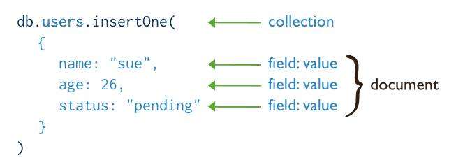

# MongoDB CRUD İşlemleri (MongoDB Öğreniyoruz 2)


## Insert Document

[Şu linkten](https://www.mongodb.com/docs/manual/reference/insert-methods/) insertOne ve InsetMany fonksiyonlarını inceleyeceğiz.

Daha önce oluşturduğumuz mymongodb veritabanına geçiş yapıp devam ediyoruz.




- **insertOne**


Veri kaydetmek için bir collection'a (tablo) ihtiyacımız olacak. Bunun için sadece veri girişi yapacağımız collection adını vermemiz yeterli. Doküman kaydetmek için  json kullanıyoruz. Süslü parantezle başlayıp biten alan dokümanımızı gösteriyor. 


```javascript
db.products.insertOne( { item: "card", qty: 15 } );

// [direct: mongos] mymongodb> db.products.insertOne( { item: "card", qty: 15 } );
// {
//   acknowledged: true,
//   insertedId: ObjectId("62cdd2893b4052b84cf2a4db")
// }
```


İleride daha detaylı göreceğiz ama şuan bilmesek de kaydettiğimiz dokümanı görmek için find fonksiyonunu kullanalım.

```javascript

db.products.find()

//[
//  { _id: ObjectId("62cdd2893b4052b84cf2a4db"), item: 'card', qty: 15 }
//]

```
MongoDb'de otomatik olarak _id adında bir alan oluşturulur bu alana unique olmak kaydıyla kendi değerimizi de yazabiliriz. Primary key olarak kullanılır.

```javascript
db.products.insertOne( {_id:"unique_id", item: "pen", qty: 5 } );

// { acknowledged: true, insertedId: 'unique_id' }
```

Tekrar verileri kontrol edelim. Artık iki dokümanımız var.

```javascript
db.products.find()

// [
//   { _id: ObjectId("62cdd2893b4052b84cf2a4db"), item: 'card', qty: 15 },
//   { _id: 'unique_id', item: 'pen', qty: 5 }
// ]

```

- **insertMany**

Aynı anda birden fazla dokümanı kaydetmek için kullanılır.


```javascript
db.products.insertMany( [
   { item: "card", qty: 15 },
   { item: "envelope", qty: 20 },
   { item: "stamps" , qty: 30 }
] );

// {
//   acknowledged: true,
//   insertedIds: {
//     '0': ObjectId("62cdd61a3b4052b84cf2a4dc"),
//     '1': ObjectId("62cdd61a3b4052b84cf2a4dd"),
//     '2': ObjectId("62cdd61a3b4052b84cf2a4de")
//   }
// }
```
- **Bulk Write**
Eğer amacınız aynı ancak bir çok dokümanı eklemek, değiştirmek veya silmekse o zaman bu fonksiyonmu kullanmalısınız.

Örnek bir bulkWrite  fonksiyonu. Detaylar için [şu sayfayı](https://www.mongodb.com/docs/manual/core/bulk-write-operations/) ziyaret ediniz.


```javascript 

 db.characters.bulkWrite(
      [
         { insertOne :
            {
               "document" :
               {
                  "_id" : 4, "char" : "Dithras", "class" : "barbarian", "lvl" : 4
               }
            }
         },
         { insertOne :
            {
               "document" :
               {
                  "_id" : 5, "char" : "Taeln", "class" : "fighter", "lvl" : 3
               }
            }
         },
         { updateOne :
            {
               "filter" : { "char" : "Eldon" },
               "update" : { $set : { "status" : "Critical Injury" } }
            }
         },
         { deleteOne :
            { "filter" : { "char" : "Brisbane" } }
         },
         { replaceOne :
            {
               "filter" : { "char" : "Meldane" },
               "replacement" : { "char" : "Tanys", "class" : "oracle", "lvl" : 4 }
            }
         }
      ]
   );
}

```


## Update Document

Update metotları için [şu sayfayı](https://www.mongodb.com/docs/manual/reference/update-methods/) kullanacağız.


Öncelikle değiştireceğimiz dokümanı bulmak gerekiyor. Bunu standart SQL'de where clause ile yapıyorduk burada onun yerine filter kullanıyoruz. 


- **updateOne**

Önce birkaç doküman kaydedelim.

```javascript
db.restaurant.insertMany( [
        { "_id" : 1, "name" : "Central Perk Cafe", "Borough" : "Manhattan" },
        { "_id" : 2, "name" : "Rock A Feller Bar and Grill", "Borough" : "Queens", "violations" : 2 },
        { "_id" : 3, "name" : "Empire State Pub", "Borough" : "Brooklyn", "violations" : 0 }
] );

// { acknowledged: true, insertedIds: { '0': 1, '1': 2, '2': 3 } }
```

Name alanına göre update yapalım. Görüleceği üzere bir adet doküman match etmiş ve bu dokümanın da bir alanı değişmiş. Bir diğer dikkat etmemiz gereken kısımda $set operatörü, aynı SQL'deki set gibi bu da ilgili alanın değerini değiştirmek içn kullanılır.

```javascript
db.restaurant.updateOne(
   { "name" : "Central Perk Cafe" },
   { $set: { "violations" : 3 } }
);

// {
//   acknowledged: true,
//   insertedId: null,
//   matchedCount: 1,
//   modifiedCount: 1,
//   upsertedCount: 0
// }
```

Olmayan bir kaydı değiştirmek isterken eğer kayıt yoksa eklenmesini istersek upset opsiyonunu kullanmalıyız.


```javascript
db.restaurant.updateOne(
   { "name" : "olmayan kaydı update ediyorum" },
   { $set: { "violations" : 3 } },
   { upsert: true }
);
```

Verileri kontrol edelim. Görüleceği üzere en altta eklenen kayır görülebilir.

```javascript
db.restaurant.find()

// [
//   {
//     _id: 1,
//     name: 'Central Perk Cafe',
//     Borough: 'Manhattan',
//     violations: 3
//   },
//   {
//     _id: 2,
//     name: 'Rock A Feller Bar and Grill',
//     Borough: 'Queens',
//     violations: 2
//   },
//   {
//     _id: 3,
//     name: 'Empire State Pub',
//     Borough: 'Brooklyn',
//     violations: 0
//   },
//   {
//     _id: ObjectId("62cde5b534e0f13b7eae76dd"),
//     name: 'olmayan kaydı update ediyorum',
//     violations: 3
//   }
// ]

```

**UYARI**: Sharded distributed cluster yapısında bir dokümanı update ederken eğer upsert kullanmak isterseniz filtreye full sharded key'i de eklemek gerekiyor [[kaynak](https://www.mongodb.com/docs/manual/reference/method/db.collection.updateOne/#upsert)].


Numeric bir alanın değerini arttırmak istiyorsak $inc operatörünü kullanmalıyız.
Diğer Field Update operatörleri için [şu sayfayı](https://www.mongodb.com/docs/manual/reference/operator/update-field/) ziyaret ediniz.

Aynı anda adı Central Perk Cafe olan restaurantın hem violation değerini 3 arttırıp bir de aslında olmayan Closed alanını eklemiş oluyoruz.

```javascript
db.restaurant.updateOne(
    { "name" : "Central Perk Cafe" },
    { $inc: { "violations" : 3}, $set: { "Closed" : true } }
);

```

Kontrol etmek için alttaki kodu çalıştırıyoruz.

```javascript

db.restaurant.find({_id:1})

// [
//   {
//     _id: 1,
//     name: 'Central Perk Cafe',
//     Borough: 'Manhattan',
//     violations: 6,
//     Closed: true
//   }
// ]

```

Dokümandan bir alanı çıkartmak için de $unset operatörünü kullanıyoruz.

```javascript
 db.restaurant.updateOne( { "name": "Central Perk Cafe" },  [{$unset: ["Closed"]}] );
// {
//   acknowledged: true,
//   insertedId: null,
//   matchedCount: 1,
//   modifiedCount: 1,
//   upsertedCount: 0
// }
```

Kontrol ettiğimizde Closed alanının dokümandan silindiğini görebiliriz.

```javascript

db.restaurant.find({"name": "Central Perk Cafe"})

// [
//   {
//     _id: 1,
//     name: 'Central Perk Cafe',
//     Borough: 'Manhattan',
//     violations: 7,
//     Review: true
//   }
// ]

```


- **updateMany**


Birden fazla dokümanı değiştirmek için kullanılır. Örneğin violation değeri 2'den büyük olan restaurantlara review diye bir alan ekleyelim ve hepsinin violation değerini 1 arttıralım. 

```javascript

db.restaurant.updateMany(
   { violations: { $gt: 2 } },
   { $set: { "Review" : true }, $inc: { "violations" : 1} }
);

// {
//   acknowledged: true,
//   insertedId: null,
//   matchedCount: 2,
//   modifiedCount: 2,
//   upsertedCount: 0
// }

```

Değişiklikliklere bakalım.

```javascript
db.restaurant.find( { violations: { $gt: 2 } })

// [
//   {
//     _id: 1,
//     name: 'Central Perk Cafe',
//     Borough: 'Manhattan',
//     violations: 7,
//     Closed: true,
//     Review: true
//   },
//   {
//     _id: ObjectId("62cde5b534e0f13b7eae76dd"),
//     name: 'olmayan kaydı update ediyorum',
//     violations: 4,
//     Review: true
//   }
// ]
```

updateOne ile updateMany fonksiyonları arasında performans olarak bir fark yok denilebilir. Sadece updateMany'de multi opsiyonu true'dur ve tek bir doküman için hata olması durumunda updateOne tek doküman için daha faydalı bilgi verir.

Birde document DB'lerin en büyük eksikliklerinden biri de data integrity konusunda zayıf olmaları. Bu nedenle updateOne kullandığınızda sadece bir dokümanın değiştiğinden emin olursunuz.


## Delete Document

Delete işlemleri için [şu sayfayı](https://www.mongodb.com/docs/manual/reference/delete-methods/) kullanıyor olacağız. İlgili başlığa tıklayarak detayları görebilirsiniz.

- **deleteOne**

Daha önce restaurant collection'ınımıza kaydettiğimiz dokümanlardan birini _id'sine göre silelim. Bunun için öcelikle restaurantları sadece _id ve name alanlarını içerecek şekilde listeleyelim.

find fonksiyonunu içindeki boş süslü parantezler bir filtreleme yapmadığımızı gösteriyor.  İkinci bölümde ise sadece name sütunu görmek istediğimizi söylemiş oluyoruz. 1 yerinde true da yazılabilirdi. _id sütnunu da istemiyor olsaydık name gibi yazıp değerini -1 dememiz yeterli olacaktı.

```javascript
db.restaurant.find({}, {name:1})

// [
//   { _id: 1, name: 'Central Perk Cafe' },
//   { _id: 2, name: 'Rock A Feller Bar and Grill' },
//   { _id: 3, name: 'Empire State Pub' },
//   {
//     _id: ObjectId("62cde5b534e0f13b7eae76dd"),
//     name: 'olmayan kaydı update ediyorum'
//   }
// ]

```
_id: ObjectId("62cde5b534e0f13b7eae76dd") olan kaydı silelim.


```javascript
db.restaurant.deleteOne({_id:ObjectId("62cde5b534e0f13b7eae76dd")});
//{ acknowledged: true, deletedCount: 1 }

```
Tekrar listeyi kontrol edelim.

```javascript
db.restaurant.find({}, {name:1})

// [
//   { _id: 1, name: 'Central Perk Cafe' },
//   { _id: 2, name: 'Rock A Feller Bar and Grill' },
//   { _id: 3, name: 'Empire State Pub' }
// ]

```

- **deleteMany**


```javascript
db.restaurant.deleteMany( { "_id" : { $gt : 1 } } );

//{ acknowledged: true, deletedCount: 2 }

```

test edecek olursak tek doküman kaldığını görebiliriz. İlgili

```javascript
 db.restaurant.find({}, {name:1})

// [ { _id: 1, name: 'Central Perk Cafe' } ]

```

## Read (Query) Document

Query metotları için [şu sayfayı](https://www.mongodb.com/docs/manual/tutorial/query-documents/) kullanacağız.

Query konusunda ayrıca tek başına detaylı göreceğimiz için burada basit bazı filtrelemeleri görüyor olacağız. ÇÜnkü henüz ilişkileri (relation) görmedik.


 


# Kaynaklar
- https://www.mongodb.com/docs/manual/reference/insert-methods/
- https://www.mongodb.com/docs/manual/tutorial/update-documents/
- https://www.mongodb.com/docs/manual/tutorial/remove-documents/
- https://www.mongodb.com/docs/manual/tutorial/query-documents/
