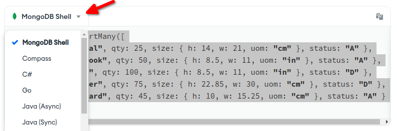

# Kurulum ve Konfigürasyon

MongoDb bütün işlerim sistemlerine kurmak mümkün, [resmi sayfasından](https://www.mongodb.com/docs/manual/administration/install-community/) Community Edition kuruluma ilgili bütün detaylara ulaşabilirsiniz. İnternette yapacağını ufak bir araştırmayla Türkçe kurulum dokümanlarına da erişebilirsiniz.

- Ayrıca isterseniz hiç MongoDb kurulumu yapmadan ilgili konu başlıklarında vereceğim linklerdeki eğitim amaçlı hazırlanmış online console'ları da kullanabilirsiniz.  

- Yada MongoDB Atlas'ın ücretsiz olan versiyonu için sayfasından hesap açarak kullanabilirsiniz. Atlas sayfasına [şu linkten](https://www.mongodb.com/atlas/database) ulaşabilirsiniz.

- Docker üzerinde çalışmak isterseniz Linux makineler için alttaki komutu çalıştırabilirsiniz.

```shell
docker run -d --restart unless-stopped --name mongodb  -e MONGO_INITDB_ROOT_USERNAME=adminuser 	-e MONGO_INITDB_ROOT_PASSWORD=Abc123  mongo:5.0-focal 
```

- Windows makinelerde Docker ile çalıştırmak için alttaki komutu çalıştırabilirsiniz.

```shell
docker run -d --restart unless-stopped --name mongodb -e MONGO_INITDB_ROOT_USERNAME=adminuser 	-e MONGO_INITDB_ROOT_PASSWORD=Abc123  mongo:5.0-windowsservercore
```

- Son olarak özellikle transaction başlığında göreceğimiz bazı konular için sharded bir cluster'a ihtiyacımız olacak. Amacımız database administrator'lük olmadığı için detaylarına girip vakit kaybetmemek adına konfigürasyonu yapılmış hazır bir docker compose kurulumu yapacağız. Bu kurulumu yapmak zorunda değilsiniz anlatacağım  konuları makaleyi takip ederek de rahatlıkla anlayabilirsiniz. Ancak tabii ki benim test edebilmek için bu versiyonu kurmam gerekiyor.

Bu kurulum için Bitnami image'ını ve compose-file'lını kullanacağız. 

```shell
git clone https://github.com/bitnami/bitnami-docker-mongodb-sharded.git

cd bitnami-docker-mongodb-sharded

docker-compose  -f docker-compose-multiple-shards.yml up -d
```

- Eğer Manuel olarak sharded bir cluster kurmak isterseniz [şu sayfayı](https://www.mongodb.com/docs/manual/tutorial/deploy-shard-cluster/)takip edebilirsiniz.


En son makaleye kadar bütün yapacaklarımızı MongopDB Shell ile yapacağız. Bu nedenle bunu da kurmamız gerekiyor.

Bunun için [MongoDB sayfasından](https://www.mongodb.com/try/download/shell)işletim sisteminize göre indirip kurabilirsiniz. MongoDB Shell Node.js ile yazılmış Javascript ile tamamen uyumlu bir uygulamadır. Daha detaylı bilgi almak ve shell'in yeteneklerini öğrenmek için [MongoDB Shell resmi sayfasını](https://www.mongodb.com/docs/mongodb-shell/) ziyaret edebilirsiniz.

Kurumunuzu yaptıktan sonra terminal, command prompt, powershell vb artık ne kullanıyorsanız alttaki komutla bağlanabilirsiniz. Bağlantı yaptıktan sonra alttaki gibi bir sonuç görüyor olmanız lazım.

```shell

mongosh "mongodb://localhost:27017"

# Current Mongosh Log ID: 62cc73d0d9b7e3f4b66fb82e
# Connecting to:          mongodb://localhost:27017/?directConnection=true&serverSelectionTimeoutMS=2000&appName=mongosh+1.5.0
# Using MongoDB:          5.0.9
# Using Mongosh:          1.5.0

# For mongosh info see: https://docs.mongodb.com/mongodb-shell/

# [direct: mongos] test> 

```
Ancak bu şekliyle örneğin veritabanlarını listelemeye alıştığımızda hata alırız çünkü login olmadık. 

```javascript
show databases

//MongoServerError: command listDatabases requires authentication

```

- Eğer MongoDB'yi doğrudan kurduysanız yani Docker kullanmadan giriş yaptıktan sonra alttaki komutlarla admin kullanıcısı oluşturup MongoDb'yi yeniden başlatmalısınız. 


```javascript
use admin
db.createUser(
  {
    user: "adminuser",
    pwd: "Abc123",
    roles: [ { role: "userAdminAnyDatabase", db: "admin" }, 
             { role: "dbAdminAnyDatabase", db: "admin" }, 
             { role: "readWriteAnyDatabase", db: "admin" } ]
  }
)
```
Daha sonra alttaki komutla tekrar bağlanıp admin kullanıcımıza rollerini atamalıyız.

```shell
mongosh "mongodb://localhost:27017" -u "adminuser" -p "Abc123"   --authenticationDatabase "admin"
```

Giriş yaptıktan sonra alttaki komutla adminuser kullanıcısına yetkilerini vermiş oluyoruz.

```javascript
use admin
db.grantRolesToUser(
   "myUserAdmin",
   [ { role: "userAdminAnyDatabase", db: "admin" }, 
     { role: "dbAdminAnyDatabase", db: "admin" }, 
     { role: "readWriteAnyDatabase", db: "admin" } ]
)

```

- Eğer MongoDB'yi Docker ile kurduysanız zaten environment variable  (-e MONGO_INITDB_ROOT_USERNAME=adminuser 	-e MONGO_INITDB_ROOT_PASSWORD=Abc123) olarak kullanıcı adı şifre vermiştik.

```
mongosh "mongodb://localhost:27017" -u "adminuser" -p "abc123" --authenticationDatabase "admin"
```

- Eğer Docker compose ile cluster versiyonu kurduysanız zaten compose dosyasında kullanıcı adı ve şifre yazıyor.

```
mongosh "mongodb://localhost:27017" -u "root" -p "password123" --authenticationDatabase "admin"

```

Evet artık veri tabanlarını listeleyebiliriz.

```javascript
show dbs

//admin   172.00 KiB
//config    4.03 MiB

```

MongoDB json kullandığı json dosyalarınızı düzenlemek için editör kullanabilirsiniz. Shell içinde _edit_ komutu ile doğrudan kullandığınız editor ile çalışma yapabilirsiniz. Bunun için editörümüzü ayarlayalım.

```javascript
config.set( "editor", "code" )
```

Eğitim boyunca tamamen MongoDB dokümanlarını takip edeceğiz. İlgili başlıklarda gerekli verililer de mevcut.  Ayrıca isterseniz hiç MongoDb kurulumu yapmadan vereceğim linklerdeki eğitim amaçlı hazırlanmış online console'ları da kullanabilirsiniz.

Takip edeceğimiz dokümanları ana sayfası için [şu linki](https://www.mongodb.com/docs/manual/?_ga=2.81384599.1231552921.1657536248-1273175735.1657536248&_gac=1.217046628.1657543561.Cj0KCQjwlK-WBhDjARIsAO2sErTeOIewvsj4odcGqxfpEcMYVYJ7ilQghSmbSeFgivcd9RWox9F-y8AaAvPAEALw_wcB) ziyaret ediniz.

Ana başlıklar şu şekilde. Kırmızı kutu içindeki başlıklara kurguyu anlyacak kadar gireceğiz. Security kısmında ise kullanıcı ekleme ve role bazlı yetkşlendirme yapacak kadar gireceğiz. Amacımız bütün dokümanı uygulamak değil konsepti anlayıp yolumuz bulacak kadar öğrenmeye çalışacağız. Yani özetle balık tutmayı öğrenceğiz. 


Developer bakış açısıyla devam edeceğiz yani amacımız administrative işler yapmak değil bu nedenle bol kod/query yazacağız. Son makalemizde Python ve Dotnet Core ile nasıl MongoDB kullanılıldığını da göreceğiz. Shell ile yaptıklarınızdan çok farklı birşey olmadığını şimdiden söyleyebilirim. 

Evet artık çalışmaya başlayabiliriz. Bundan sonra yapacağımız bütün örneklerde kullanmak amacıyla bir database oluşturacağız. 


```javascript
use mymongodb
```

MongoDB'de database olulturmak için aktif database değiştirmek yeterli.

Yukarıda bahsettiğimiz gibi MongoDB'nin kullanıdı veri yapısı json. Bu nedenle eğer json hakkında bilginiz yoksa bir sonraki makaleye geçmeden önce biraz çalışma yapınız. Youtube dahil bir çok sitede kaynak bulabilirsiniz.


# MongoDB'de Basit CRUD İşlemleri (MongoDB Öğreniyoruz 2)

MongoDB'de standart json'daki veri tiplerinden daha fazlası vardır. Bir nevi json'ın extend edilmiş halidir. Bütün BSON tiplerini görmek için [şu sayfayı](https://www.mongodb.com/docs/manual/reference/bson-types/) ziyaret ediniz. 


## Insert Document

[Şu linkten](https://www.mongodb.com/docs/manual/reference/insert-methods/) insertOne ve InsetMany fonksiyonlarını inceleyeceğiz.

Daha önce oluşturduğumuz mymongodb veritabanına geçiş yapıp devam ediyoruz.


- **insertOne**


Veri kaydetmek için bir collection'a (tablo) ihtiyacımız olacak. Bunun için sadece veri girişi yapacağımız collection adını vermemiz yeterli. Doküman kaydetmek için  json kullanıyoruz. Süslü parantezle başlayıp biten alan dokümanımızı gösteriyor. 


```javascript
db.products.insertOne( { item: "card", qty: 15 } );

// [direct: mongos] mymongodb> db.products.insertOne( { item: "card", qty: 15 } );
// {
//   acknowledged: true,
//   insertedId: ObjectId("62cdd2893b4052b84cf2a4db")
// }
```


İleride daha detaylı göreceğiz ama şuan bilmesek de kaydettiğimiz dokümanı görmek için find fonksiyonunu kullanalım.

```javascript

db.products.find()

//[
//  { _id: ObjectId("62cdd2893b4052b84cf2a4db"), item: 'card', qty: 15 }
//]

```
MongoDb'de otomatik olarak _id adında bir alan oluşturulur bu alana unique olmak kaydıyla kendi değerimizi de yazabiliriz. Primary key olarak kullanılır.

```javascript
db.products.insertOne( {_id:"unique_id", item: "pen", qty: 5 } );

// { acknowledged: true, insertedId: 'unique_id' }
```

Tekrar verileri kontrol edelim. Artık iki dokümanımız var.

```javascript
db.products.find()

// [
//   { _id: ObjectId("62cdd2893b4052b84cf2a4db"), item: 'card', qty: 15 },
//   { _id: 'unique_id', item: 'pen', qty: 5 }
// ]

```

- **insertMany**

Aynı anda birden fazla dokümanı kaydetmek için kullanılır.


```javascript
db.products.insertMany( [
   { item: "card", qty: 15 },
   { item: "envelope", qty: 20 },
   { item: "stamps" , qty: 30 }
] );

// {
//   acknowledged: true,
//   insertedIds: {
//     '0': ObjectId("62cdd61a3b4052b84cf2a4dc"),
//     '1': ObjectId("62cdd61a3b4052b84cf2a4dd"),
//     '2': ObjectId("62cdd61a3b4052b84cf2a4de")
//   }
// }
```
- **Bulk Write**
Eğer amacınız aynı ancak bir çok dokümanı eklemek, değiştirmek veya silmekse o zaman bu fonksiyonmu kullanmalısınız.

Örnek bir bulkWrite  fonksiyonu. Detaylar için [şu sayfayı](https://www.mongodb.com/docs/manual/core/bulk-write-operations/) ziyaret ediniz.


```javascript 

 db.characters.bulkWrite(
      [
         { insertOne :
            {
               "document" :
               {
                  "_id" : 4, "char" : "Dithras", "class" : "barbarian", "lvl" : 4
               }
            }
         },
         { insertOne :
            {
               "document" :
               {
                  "_id" : 5, "char" : "Taeln", "class" : "fighter", "lvl" : 3
               }
            }
         },
         { updateOne :
            {
               "filter" : { "char" : "Eldon" },
               "update" : { $set : { "status" : "Critical Injury" } }
            }
         },
         { deleteOne :
            { "filter" : { "char" : "Brisbane" } }
         },
         { replaceOne :
            {
               "filter" : { "char" : "Meldane" },
               "replacement" : { "char" : "Tanys", "class" : "oracle", "lvl" : 4 }
            }
         }
      ]
   );
}

```


## Update Document

Update metotları için [şu sayfayı](https://www.mongodb.com/docs/manual/reference/update-methods/) kullanacağız.


Öncelikle değiştireceğimiz dokümanı bulmak gerekiyor. Bunu standart SQL'de where clause ile yapıyorduk burada onun yerine filter kullanıyoruz. 


- **updateOne**

Önce birkaç doküman kaydedelim.

```javascript
db.restaurant.insertMany( [
        { "_id" : 1, "name" : "Central Perk Cafe", "Borough" : "Manhattan" },
        { "_id" : 2, "name" : "Rock A Feller Bar and Grill", "Borough" : "Queens", "violations" : 2 },
        { "_id" : 3, "name" : "Empire State Pub", "Borough" : "Brooklyn", "violations" : 0 }
] );

// { acknowledged: true, insertedIds: { '0': 1, '1': 2, '2': 3 } }
```

Name alanına göre update yapalım. Görüleceği üzere bir adet doküman match etmiş ve bu dokümanın da bir alanı değişmiş. Bir diğer dikkat etmemiz gereken kısımda $set operatörü, aynı SQL'deki set gibi bu da ilgili alanın değerini değiştirmek içn kullanılır.

```javascript
db.restaurant.updateOne(
   { "name" : "Central Perk Cafe" },
   { $set: { "violations" : 3 } }
);

// {
//   acknowledged: true,
//   insertedId: null,
//   matchedCount: 1,
//   modifiedCount: 1,
//   upsertedCount: 0
// }
```

Olmayan bir kaydı değiştirmek isterken eğer kayıt yoksa eklenmesini istersek upset opsiyonunu kullanmalıyız.


```javascript
db.restaurant.updateOne(
   { "name" : "olmayan kaydı update ediyorum" },
   { $set: { "violations" : 3 } },
   { upsert: true }
);
```

Verileri kontrol edelim. Görüleceği üzere en altta eklenen kayır görülebilir.

```javascript
db.restaurant.find()

// [
//   {
//     _id: 1,
//     name: 'Central Perk Cafe',
//     Borough: 'Manhattan',
//     violations: 3
//   },
//   {
//     _id: 2,
//     name: 'Rock A Feller Bar and Grill',
//     Borough: 'Queens',
//     violations: 2
//   },
//   {
//     _id: 3,
//     name: 'Empire State Pub',
//     Borough: 'Brooklyn',
//     violations: 0
//   },
//   {
//     _id: ObjectId("62cde5b534e0f13b7eae76dd"),
//     name: 'olmayan kaydı update ediyorum',
//     violations: 3
//   }
// ]

```

**UYARI**: Sharded distributed cluster yapısında bir dokümanı update ederken eğer upsert kullanmak isterseniz filtreye full sharded key'i de eklemek gerekiyor [[kaynak](https://www.mongodb.com/docs/manual/reference/method/db.collection.updateOne/#upsert)].


Numeric bir alanın değerini arttırmak istiyorsak $inc operatörünü kullanmalıyız.
Diğer Field Update operatörleri için [şu sayfayı](https://www.mongodb.com/docs/manual/reference/operator/update-field/) ziyaret ediniz.

Aynı anda adı Central Perk Cafe olan restaurantın hem violation değerini 3 arttırıp bir de aslında olmayan Closed alanını eklemiş oluyoruz.

```javascript
db.restaurant.updateOne(
    { "name" : "Central Perk Cafe" },
    { $inc: { "violations" : 3}, $set: { "Closed" : true } }
);

```

Kontrol etmek için alttaki kodu çalıştırıyoruz.

```javascript

db.restaurant.find({_id:1})

// [
//   {
//     _id: 1,
//     name: 'Central Perk Cafe',
//     Borough: 'Manhattan',
//     violations: 6,
//     Closed: true
//   }
// ]

```

Dokümandan bir alanı çıkartmak için de $unset operatörünü kullanıyoruz.

```javascript
 db.restaurant.updateOne( { "name": "Central Perk Cafe" },  [{$unset: ["Closed"]}] );
// {
//   acknowledged: true,
//   insertedId: null,
//   matchedCount: 1,
//   modifiedCount: 1,
//   upsertedCount: 0
// }
```

Kontrol ettiğimizde Closed alanının dokümandan silindiğini görebiliriz.

```javascript

db.restaurant.find({"name": "Central Perk Cafe"})

// [
//   {
//     _id: 1,
//     name: 'Central Perk Cafe',
//     Borough: 'Manhattan',
//     violations: 7,
//     Review: true
//   }
// ]

```


- **updateMany**


Birden fazla dokümanı değiştirmek için kullanılır. Örneğin violation değeri 2'den büyük olan restaurantlara review diye bir alan ekleyelim ve hepsinin violation değerini 1 arttıralım. 

```javascript

db.restaurant.updateMany(
   { violations: { $gt: 2 } },
   { $set: { "Review" : true }, $inc: { "violations" : 1} }
);

// {
//   acknowledged: true,
//   insertedId: null,
//   matchedCount: 2,
//   modifiedCount: 2,
//   upsertedCount: 0
// }

```

Değişiklikliklere bakalım.

```javascript
db.restaurant.find( { violations: { $gt: 2 } })

// [
//   {
//     _id: 1,
//     name: 'Central Perk Cafe',
//     Borough: 'Manhattan',
//     violations: 7,
//     Closed: true,
//     Review: true
//   },
//   {
//     _id: ObjectId("62cde5b534e0f13b7eae76dd"),
//     name: 'olmayan kaydı update ediyorum',
//     violations: 4,
//     Review: true
//   }
// ]
```

updateOne ile updateMany fonksiyonları arasında performans olarak bir fark yok denilebilir. Sadece updateMany'de multi opsiyonu true'dur ve tek bir doküman için hata olması durumunda updateOne tek doküman için daha faydalı bilgi verir.

Birde document DB'lerin en büyük eksikliklerinden biri de data integrity konusunda zayıf olmaları. Bu nedenle updateOne kullandığınızda sadece bir dokümanın değiştiğinden emin olursunuz.


## Delete Document

Delete işlemleri için [şu sayfayı](https://www.mongodb.com/docs/manual/reference/delete-methods/) kullanıyor olacağız. İlgili başlığa tıklayarak detayları görebilirsiniz.

- **deleteOne**

Daha önce restaurant collection'ınımıza kaydettiğimiz dokümanlardan birini _id'sine göre silelim. Bunun için öcelikle restaurantları sadece _id ve name alanlarını içerecek şekilde listeleyelim.

find fonksiyonunu içindeki boş süslü parantezler bir filtreleme yapmadığımızı gösteriyor.  İkinci bölümde ise sadece name sütunu görmek istediğimizi söylemiş oluyoruz. 1 yerinde true da yazılabilirdi. _id sütnunu da istemiyor olsaydık name gibi yazıp değerini -1 dememiz yeterli olacaktı.

```javascript
db.restaurant.find({}, {name:1})

// [
//   { _id: 1, name: 'Central Perk Cafe' },
//   { _id: 2, name: 'Rock A Feller Bar and Grill' },
//   { _id: 3, name: 'Empire State Pub' },
//   {
//     _id: ObjectId("62cde5b534e0f13b7eae76dd"),
//     name: 'olmayan kaydı update ediyorum'
//   }
// ]

```
_id: ObjectId("62cde5b534e0f13b7eae76dd") olan kaydı silelim.


```javascript
db.restaurant.deleteOne({_id:ObjectId("62cde5b534e0f13b7eae76dd")});
//{ acknowledged: true, deletedCount: 1 }

```
Tekrar listeyi kontrol edelim.

```javascript
db.restaurant.find({}, {name:1})

// [
//   { _id: 1, name: 'Central Perk Cafe' },
//   { _id: 2, name: 'Rock A Feller Bar and Grill' },
//   { _id: 3, name: 'Empire State Pub' }
// ]

```

- **deleteMany**


```javascript
db.restaurant.deleteMany( { "_id" : { $gt : 1 } } );

//{ acknowledged: true, deletedCount: 2 }

```

test edecek olursak tek doküman kaldığını görebiliriz. İlgili

```javascript
 db.restaurant.find({}, {name:1})

// [ { _id: 1, name: 'Central Perk Cafe' } ]

```

## Read (Query) Document

Query metotları için [şu sayfayı](https://www.mongodb.com/docs/manual/tutorial/query-documents/) kullanacağız. Sayfa açıldığında örneklerin Compass üzerinde gösterildiğini görebilirsiniz. 

Menüden Mongo Shell'i seçerek örnekleri görebilir hatta sanal shell üzerinde testlerinizi de yapabilirsiniz.



Query konusunda ayrıca tek başına detaylı göreceğimiz için burada basit bazı filtrelemeleri görüyor olacağız. 


Öncelikle biraz kayır girelim.
```javascript
db.inventory.insertMany([
   { item: "journal", qty: 25, size: { h: 14, w: 21, uom: "cm" }, status: "A" },
   { item: "notebook", qty: 50, size: { h: 8.5, w: 11, uom: "in" }, status: "A" },
   { item: "paper", qty: 100, size: { h: 8.5, w: 11, uom: "in" }, status: "D" },
   { item: "planner", qty: 75, size: { h: 22.85, w: 30, uom: "cm" }, status: "D" },
   { item: "postcard", qty: 45, size: { h: 10, w: 15.25, uom: "cm" }, status: "A" }
]);


// {
//   acknowledged: true,
//   insertedIds: {
//     '0': ObjectId("62cf3797b8a5ff9793ca03e4"),
//     '1': ObjectId("62cf3797b8a5ff9793ca03e5"),
//     '2': ObjectId("62cf3797b8a5ff9793ca03e6"),
//     '3': ObjectId("62cf3797b8a5ff9793ca03e7"),
//     '4': ObjectId("62cf3797b8a5ff9793ca03e8")
//   }
// }

```

- **Bütün Kayıtları Çekmek**

içerideki içi boş süslü parantezler bir filtreleme yapmadığımızı gösteriyor.

```javascript
db.inventory.find( {} )
```

- **Eşitlik Şartı ile Filtreleme**

Herhangi bir alanın değerine göre filtre yapmak için tek yapmamız gereken alan için beklediğimiz değeri json formatında yazmak.

```javascript
db.inventory.find( {status: "D" } )

// [
//   {
//     _id: ObjectId("62cf3797b8a5ff9793ca03e6"),
//     item: 'paper',
//     qty: 100,
//     size: { h: 8.5, w: 11, uom: 'in' },
//     status: 'D'
//   },
//   {
//     _id: ObjectId("62cf3797b8a5ff9793ca03e7"),
//     item: 'planner',
//     qty: 75,
//     size: { h: 22.85, w: 30, uom: 'cm' },
//     status: 'D'
//   }
// ]

```

- **Query Operatörleri ile Filtreleme**

Bütün Query Operatörleri için [şu linki](https://www.mongodb.com/docs/manual/reference/operator/query/#std-label-query-selectors) ziyaret ediniz.

Status alanının işereceği değerler için $in operatörü kullanılmış.

```javascript
db.inventory.find( { status: { $in: [ "A", "D" ] } } )

// [
// kısaltıldı   
// ,
//   {
//     _id: ObjectId("62cf3797b8a5ff9793ca03e5"),
//     item: 'notebook',
//     qty: 50,
//     size: { h: 8.5, w: 11, uom: 'in' },
//     status: 'A'
//   },
//   {
//     _id: ObjectId("62cf3797b8a5ff9793ca03e6"),
//     item: 'paper',
//     qty: 100,
//     size: { h: 8.5, w: 11, uom: 'in' },
//     status: 'D'
//   },
// kısaltıldı
// ]

```
 
- **AND Operatörü Kullanımı**

```sql
SELECT * FROM inventory WHERE status = "A" AND qty < 30
```

Standart SQL'de yukarıdaki gibi yazılmış bir ifadenin MongoDB'de yazımı şu şekildedir.

```javascript

db.inventory.find( { status: "A", qty: { $lt: 30 } } )
// veya and operatörünü açıkça yazarak
db.inventory.find( { $and: [ { status: "A" }, { qty: { $lt: 30 } } ] } )

// [
//   {
//     _id: ObjectId("62cf3797b8a5ff9793ca03e4"),
//     item: 'journal',
//     qty: 25,
//     size: { h: 14, w: 21, uom: 'cm' },
//     status: 'A'
//   }
// ]
```

- **OR Operatörü Kullanımı**

```sql
SELECT * FROM inventory WHERE status = "A" AND ( qty < 30 OR item LIKE "p%")
```
Standart SQL'de yukarıdaki gibi yazılmış bir ifadenin MongoDB'de yazımı şu şekildedir.

_/^p/_ ifadesi bir reqular expression ifadesidir. p harfi ile başlayan kelimeleri içerir. Regex hakkında daha detaylı bilgi için [şu sayfayı](https://www.mongodb.com/docs/manual/reference/operator/query/regex/#mongodb-query-op.-regex) ziyaret ediniz.

```javascript
db.inventory.find( {
     status: "A",
     $or: [ { qty: { $lt: 30 } }, { item: /^p/ } ]
} )

// [
//   {
//     _id: ObjectId("62cf3797b8a5ff9793ca03e4"),
//     item: 'journal',
//     qty: 25,
//     size: { h: 14, w: 21, uom: 'cm' },
//     status: 'A'
//   },
//   {
//     _id: ObjectId("62cf3797b8a5ff9793ca03e8"),
//     item: 'postcard',
//     qty: 45,
//     size: { h: 10, w: 15.25, uom: 'cm' },
//     status: 'A'
//   }
// ]
```


MongoDB'de CRUD işlemlerine hızlı bir giriş yapmış olduk. Bundan sonraki bir kaz yazıda CRUD işlemlerinin detaylarına gireceğiz.

İyi çalışmalar, görüşmek üzere.

## Schema Kullanımı

Şimdi bu nereden çıktı diyebilirsiniz. Hani MongoDB'de schema zorunluluğu yoktu? Evet zorunluluk yok ancak seçenek olarak var. MongoDB [json schema](https://json-schema.org/draft/2020-12/json-schema-validation.html) standartlarını destekler.

Amaç aslında verinin tutarlılığını sağlamak. Insert ve update işlemlerinde verinin belirtilen kurallara göre kaydedilip edilmediğini kontrol eder. Konu ile ilgili daha detaylı bilgi almak için [şu sayfayı](https://www.mongodb.com/docs/manual/core/schema-validation/) ve $jsonSchema operatörü için [şu sayfayı](https://www.mongodb.com/docs/manual/reference/operator/query/jsonSchema/#mongodb-query-op.-jsonSchema) ziyaret ediniz.

Schema collection create edilirken belirlenir. Örnek olarak ilgili sayfadan aldığımız aşağıdaki örneği test edelim.


Öncelikle collection'umuzu $jsonSchema operatörünü de kullanarak oluşturuyoruz.

```javascript
db.createCollection("students", {
   validator: {
      $jsonSchema: {
         bsonType: "object",
         required: [ "name", "year", "major", "address" ],
         properties: {
            name: {
               bsonType: "string",
               description: "must be a string and is required"
            },
            year: {
               bsonType: "int",
               minimum: 2017,
               maximum: 3017,
               description: "must be an integer in [ 2017, 3017 ] and is required"
            },
            major: {
               enum: [ "Math", "English", "Computer Science", "History", null ],
               description: "can only be one of the enum values and is required"
            },
            gpa: {
               bsonType: [ "double" ],
               description: "must be a double if the field exists"
            },
            address: {
               bsonType: "object",
               required: [ "city" ],
               properties: {
                  street: {
                     bsonType: "string",
                     description: "must be a string if the field exists"
                  },
                  city: {
                     bsonType: "string",
                     description: "must be a string and is required"
                  }
               }
            }
         }
      }
   }
})
```

Daha sonra students collection'ını üzerinde kurallarımızı test ediyoruz.

```javascript
use students

// gpa alanı double olması gerekirken biz integer verelim.

db.students.insertOne( {
   name: "Alice",
   year: Int32( 2019 ),
   major: "History",
   gpa: Int32( 3 ),
   address: {
      city: "NYC",
      street: "33rd Street"
   }
} )

// aiağıdaki gibi bir hata alırız.

// Uncaught:
// MongoServerError: Document failed validation
// Additional information: {
//   failingDocumentId: ObjectId("62d18e283d35a3afc00610a0"),
//   details: {
//     operatorName: '$jsonSchema',
//     schemaRulesNotSatisfied: [
//       {
//         operatorName: 'properties',
//         propertiesNotSatisfied: [ { propertyName: 'gpa', details: [ [Object] ] } ]
//       }
//     ]
//   }
// }

```
Schema'ların bir ilginç yönü de bir collection üzerinde schema zorunluğu olmasa da schema'ya uygun dokümanların filtrelenmesine olanak tanımasıdır.

```javascript

db.inventory2.insertMany( [
   { item: "journal", qty: NumberInt(25), size: { h: 14, w: 21, uom: "cm" }, instock: true },
   { item: "notebook", qty: NumberInt(50), size: { h: 8.5, w: 11, uom: "in" }, instock: true },
   { item: "paper", qty: NumberInt(100), size: { h: 8.5, w: 11, uom: "in" }, instock: 1 },
   { item: "planner", qty: NumberInt(75), size: { h: 22.85, w: 30, uom: "cm" }, instock: 1 },
   { item: "postcard", qty: NumberInt(45), size: { h: 10, w: 15.25, uom: "cm" }, instock: true },
   { item: "apple", qty: NumberInt(45), status: "A", instock: true },
   { item: "pears", qty: NumberInt(50), status: "A", instock: true }
] )

```

Daha sonra bir schema oluşturalım

```javascript
let myschema =  {
      required: [ "item", "qty", "instock" ],
      properties: {
         item: { bsonType: "string" },
         qty: { bsonType: "int" },
         size: {
            bsonType: "object",
            required: [ "uom" ],
            properties: {
               uom: { bsonType: "string" },
               h: { bsonType: "double" },
               w: { bsonType: "double" }
            }
          },
          instock: { bsonType: "bool" }
      }
 }

```
ve bunu filtrede kullanalım.

```javascript
db.inventory2.find( { $jsonSchema: myschema } )

// [
//   {
//     _id: ObjectId("62d18fe83d35a3afc00610a6"),
//     item: 'apple',
//     qty: 45,
//     status: 'A',
//     instock: true
//   },
//   {
//     _id: ObjectId("62d18fe83d35a3afc00610a7"),
//     item: 'pears',
//     qty: 50,
//     status: 'A',
//     instock: true
//   }
// ]

```
Mesela schema'ya uymayan bütün kayıtları update edelim.


```javascript

db.inventory2.updateMany( { $nor: [ { $jsonSchema: myschema } ] }, { $set: { isValid: false } } )
```
Yada uymayan bütün dokümanları silelim.

```javascript
db.inventory2.deleteMany( { $nor: [ { $jsonSchema: myschema } ] } )
```


# Kaynaklar
- https://www.mongodb.com/docs/manual/reference/insert-methods/
- https://www.mongodb.com/docs/manual/tutorial/update-documents/
- https://www.mongodb.com/docs/manual/tutorial/remove-documents/
- https://www.mongodb.com/docs/manual/tutorial/query-documents/
- https://www.mongodb.com/docs/manual/reference/operator/query/#std-label-query-selectors
