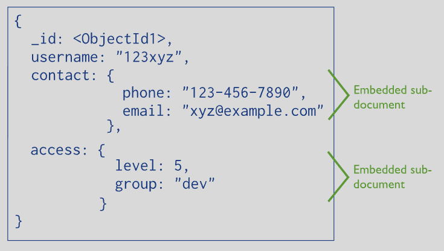
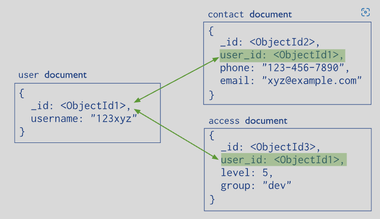
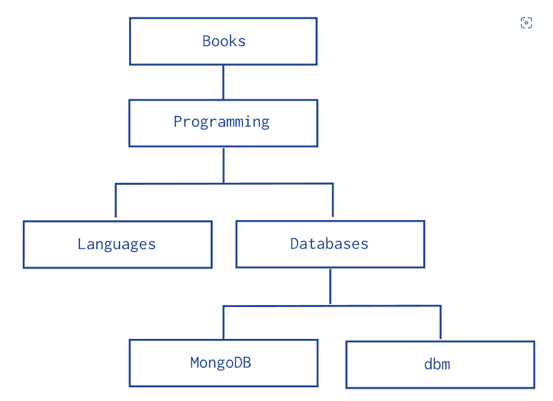

# MongoDB'de Embedded, Referenced Document ve Relation Kavramları (MongoDB Öğreniyoruz 3)

**Embedded** veya **nested document** bir dokümanın içine başka bir dokümanın konulması anlamına geliyor. Aşağıdaki dokümanı inceleyelim. Dokümandaki size alanı bir embedded dokümandır.



[resim kaynak](https://www.mongodb.com/docs/manual/core/data-model-design/)


**Referenced document** ise başka bir collection'daki (tablodaki) dokümanın bir dokuman içinde referans edilmesidir. Referans işlemi _id alanı ile yapılır. Bu konu biraz aklımıza RDBMS'i getirebilir. Ancak mümkün olduğunda oradaki relation kavramlarında kendimizi uzak tutmaya çalışalım. Document DB'lerin buradaki felsefesi hakikaten çok farklı. Adım adım örneklerle MongoDb'deki relationship kavramını anlamaya çalışacağız.



[resim kaynak](https://www.mongodb.com/docs/manual/core/data-model-design/)

- **Embedded Doküman ile One-to-One İlişki Kurmak**

Kullanıcının adres bilgisi embedded document olarak gösteriliyor. Burada address bilgisi ilgili doküman için bir tane oluşturulmuş. Tabii ki bu adresi açık bir şekilde name alanı gibi de yazabilirdik. Ancak bu şekilde hem bir model oluşturmuş ve bütün adres bilgilerini aynı kavram (doküman) altında toplamış olduk. Hakikaten document DB'ler biraz da gerçek hayatı modellemek ve okunabilir veritabanı oluşturmak için doğmuşlardır. Gerçekte de bir doküman doldurduğumuzda adres bilgisi aynı doküman üzerinde ancak kendi ait alanda doldurulur.


 
```javascript

{
   _id: "joe",
   name: "Joe Bookreader",
   address: {
              street: "123 Fake Street",
              city: "Faketon",
              state: "MA",
              zip: "12345"
            }
}
```

- **Embedded Doküman ile One-to-Many İlişki Kurmak**

Görüleceği üzere bu  sefer kişiye ait adres bilgisi iki tane. Bu durumda embedded dokümanları dizi olarak tutarak one-to-many ilişki kurmuş oluyoruz. Ancak şunu unutmamalıyız ki MongoDB'de bir doküman en fazla 16 MB olabilir. Yani Bu şekilde bir ilişki kurduğumuzda dokümanı çok büyütmememiz gerekiyor. İleride performans ile ilgili konuları işlediğimizde best-practice'lere değiniyor olacağım.

Tekrar etmeyen ve içine bulunduğu dokümanla sıkı bir ilişkisi olan verileri embedded olarak eklemek query'lerinizi ciddi anlamda hızlandıracaktır.

```javascript
{
   "_id": "joe",
   "name": "Joe Bookreader",
   "addresses": [
                {
                  "street": "123 Fake Street",
                  "city": "Faketon",
                  "state": "MA",
                  "zip": "12345"
                },
                {
                  "street": "1 Some Other Street",
                  "city": "Boston",
                  "state": "MA",
                  "zip": "12345"
                }
              ]
 }
```

Daha önce standart SQL veritabanı kullanmış arkadaşların kafasında deli sorular olduğuna eminim. Ama biraz daha sabrederseniz bütün sorularınıza cevap bulacağınıza eminim.


- **Referenced Doküman ile One-to-Many İlişki Kurmak**

Peki burada neden embedded doküman tercih etmedik? Birincisi bir yayınevinin basmış olduğu binlerce kitap olabilir. Bunların hepsini tek dokümanda tutmak limitleri aşmamıza sebep olabilir. İkincisi Burada göz ardı ettik ancak kitap dokümanlarının yayınevi dışında başka bağımlılıkları da olabilir örneğin yazar (author) gibi. Ve yazar verisi tekrar eden yani doğrudan tek bir kitapla ilişki olayan veridir. haliyle bir yazar birden fazla kitap yazabilir. Bu durumda kitap dokümanını ayrı collection da tutarak yazar collection'ı ile de ilişki kurmak mantıklı olabilir.

Örnekte yayınevleri collection'nından bir yayınevi ve kitaplar collection'ından iki kitap alınmıştır.

```javascript

// Yayınevi
{
   _id: "oreilly",
   name: "O'Reilly Media",
   founded: 1980,
   location: "CA",
   books: [123456789, 234567890, ...]
}

//Kitap 1 
{
    _id: 123456789,
    title: "MongoDB: The Definitive Guide",
    author: [ "Kristina Chodorow", "Mike Dirolf" ],
    published_date: ISODate("2010-09-24"),
    pages: 216,
    language: "English"
}

// Kitap 2
{
   _id: 234567890,
   title: "50 Tips and Tricks for MongoDB Developer",
   author: "Kristina Chodorow",
   published_date: ISODate("2011-05-06"),
   pages: 68,
   language: "English"
}
```

Ancak burada halen bir problemimiz var. Yayınevi collection'ı sadece _id alanı ile ilişkileri bir dizide tutarak bile 16 MB'ı zorlayabilir. Ayrıca yayınevine ait kitap sayısı binleri bulmaya başladıkça ileride göreceğiz lookup ile yapacağımız join'lerde yavaşlama neden olacaktır. Bu nedenle unbounded (sınırı olmayan) growing array (büyüyen dizi) durumu oluşabilecek yerlerde ilişkiyi tersine çevirmek mantıklı olacaktır. Yani kitap üzerinde yayınevi bilgisini reference olarak tutmak.

Kitap dokümanları üzerinde publisher_id alanında yayınevi id'si kaydedilmiş.

```javascript
// Yayınevi
{
   _id: "oreilly",
   name: "O'Reilly Media",
   founded: 1980,
   location: "CA"
}

//Kitap 1 
{
   _id: 123456789,
   title: "MongoDB: The Definitive Guide",
   author: [ "Kristina Chodorow", "Mike Dirolf" ],
   published_date: ISODate("2010-09-24"),
   pages: 216,
   language: "English",
   publisher_id: "oreilly"
}

// Kitap 2
{
   _id: 234567890,
   title: "50 Tips and Tricks for MongoDB Developer",
   author: "Kristina Chodorow",
   published_date: ISODate("2011-05-06"),
   pages: 68,
   language: "English",
   publisher_id: "oreilly"
}

```

- **Many-to-Many Relationship**

MongoDB'de many-to-many ilişki iki tablo ile kurulur. Aşağıdaki örnekte görüleceği üzere yazarlar ve kitaplar arasında many to many ilişki kurulmuş.

Tabi buradaki örnekte iki tarafta da   unbounded (sınırı olmayan) growing array (büyüyen dizi) durumu oluşabilecek durum olmadığı varsayılıyor. Daha doğrusu öyle bir durum olmayacak şekilde modellenmiş  collection'larla çalışıldığı için bu ilişkinin kurulması mantıklı.


```javascript
//Authors (Yazar) collection

{
  _id: 1,
  name: "Peter Standford",
  books: [1, 2]
}
{
  _id: 2,
  name: "Georg Peterson",
  books: [2]
}

// Books (kitap) collection
{
  _id: 1,
  title: "A tale of two people",
  categories: ["drama"],
  authors: [1, 2]
}
{
  _id: 2,
  title: "A tale of two space ships",
  categories: ["scifi"],
  authors: [1]
}

```

- **Parent Referans ile Model Tree Structure**
Şekildeki gibi bir veri yapımızın olması durumunda nasıl bir model kurabiliriz onu inceleyceğiz. 



Dikkat edilirse her doküman için bir parent  kaydı var.


```javascript

db.categories.insertMany( [
   { _id: "MongoDB", parent: "Databases" },
   { _id: "dbm", parent: "Databases" },
   { _id: "Databases", parent: "Programming" },
   { _id: "Languages", parent: "Programming" },
   { _id: "Programming", parent: "Books" },
   { _id: "Books", parent: null }
] )

```

Dokümanları kaydettikten sonra örneğin MongoDB kategorisinin parent'ının Datebase oduğu görülebiliyor.

```javascript
db.categories.findOne( { _id: "MongoDB" } ).parent

//Databases
```
- **Child Referans ile Model Tree Structure**

Üstteki örnekte amacımız bulduğumuz dokümanın parent'ına ulaşmka iken burada child'larına ulaşmaya çalışıyoruz.

Kayıtlarımızı giriyoruz. Bu arada dikkat ederseniz halen aynı collection'a kayır giriyoruz ancak farklı alanları kullanıyoruz. YAni veritabanı şeması veya buna uyma zorunluluğumuz yok.

```javascript
db.categories.insertMany( [
   { _id: "MongoDB2", children: [] },
   { _id: "dbm2", children: [] },
   { _id: "Databases2", children: [ "MongoDB2", "dbm2" ] },
   { _id: "Languages2", children: [] },
   { _id: "Programming2", children: [ "Databases2", "Languages2" ] },
   { _id: "Books2", children: [ "Programming2" ] }
] )

```

Databases2 başlığının child'larına bakalım.dat
```javascript
db.categories.findOne( { _id: "Databases2" } ).children

//[ 'MongoDB2', 'dbm2' ]
```
- **Materialized Path ile Model Tree Structure**


Burada amacımız her bir dokümanın tree üzerindeki path'ini kaydederek daha sonra bu herhangi bir path üzerindeki dokümanlara erişmek.

```javascript

db.categories.insertMany( [
   { _id: "Books3", path: null },
   { _id: "Programming3", path: ",Books3," },
   { _id: "Databases3", path: ",Books3,Programming3," },
   { _id: "Languages3", path: ",Books3,Programming3," },
   { _id: "MongoDB3", path: ",Books3,Programming3,Databases3," },
   { _id: "dbm3", path: ",Books3,Programming3,Databases3," }
] )

```

Örneğin path'inde Programming3 geçen dokümanları bulalım.

```javascript

db.categories.find( { path: /,Programming3,/ } )

// [
//   { _id: 'Databases3', path: ',Books3,Programming3,' },
//   { _id: 'Languages3', path: ',Books3,Programming3,' },
//   { _id: 'MongoDB3', path: ',Books3,Programming3,Databases3,' },
//   { _id: 'dbm3', path: ',Books3,Programming3,Databases3,' }
// ]

```

- **Nested Set ile Model Tree Structure**


Nested set'lerde hem gidiş nem de dönüş yolu kaydedilir. Tabi bu haliyle bu tarz bir dokümanı kaydetmek zordur. Arada bir dokümanın silindiğini veya araya bir doküman koymak durumunda olduğumuzu düşünün.

```javascript
db.categories.insertMany( [
   { _id: "Books5", parent: 0, left: 1, right: 12 },
   { _id: "Programming5", parent: "Books5", left: 2, right: 11 },
   { _id: "Languages5", parent: "Programming5", left: 3, right: 4 },
   { _id: "Databases5", parent: "Programming5", left: 5, right: 10 },
   { _id: "MongoDB5", parent: "Databases5", left: 6, right: 7 },
   { _id: "dbm5", parent: "Databases5", left: 8, right: 9 }
] )

```
Mesela Programming5 dokümanının bütün child'larını bulmaya çalışalım.


```javascript

var databaseCategory = db.categories.findOne( { _id: "Programming5" } );

db.categories.find( { left: { $gt: databaseCategory.left }, right: { $lt: databaseCategory.right } } );


// [
//   { _id: 'Languages5', parent: 'Programming5', left: 3, right: 4 },
//   { _id: 'Databases5', parent: 'Programming5', left: 5, right: 10 },
//   { _id: 'MongoDB5', parent: 'Databases5', left: 6, right: 7 },
//   { _id: 'dbm5', parent: 'Databases5', left: 8, right: 9 }
// ]


```


```javascript
db.categories.insertMany( [
   { _id: "Books4", parent: 0, left: 1, right: 12 },
   { _id: "Programming4", parent: "Books4", left: 2, right: 11 },
   { _id: "Languages4", parent: "Programming4", left: 3, right: 4 },
   { _id: "Databases4", parent: "Programming4", left: 5, right: 10 },
   { _id: "MongoDB4", parent: "Databases4", left: 6, right: 7 },
   { _id: "dbm4", parent: "Databases4", left: 8, right: 9 }
] )

```

# MongoDB'de Relation Kullanımı Üzerine Best Practice'ler 


TODO : https://www.mongodb.com/developer/products/mongodb/mongodb-schema-design-best-practices/

TODO: MongoDB Application Modernization Guide da power point sunumunda çok güzel şekiller var bakmalısın


## Database Referans

- https://www.mongodb.com/docs/manual/reference/database-references/
- https://learnmongodbthehardway.com/schema/schemabasics/
- https://www.mongodb.com/docs/manual/tutorial/model-embedded-one-to-one-relationships-between-documents/
- https://www.mongodb.com/docs/manual/tutorial/model-embedded-one-to-many-relationships-between-documents/
- https://www.mongodb.com/docs/manual/tutorial/model-referenced-one-to-many-relationships-between-documents/
- https://www.mongodb.com/docs/manual/tutorial/model-tree-structures-with-parent-references/
- https://www.mongodb.com/docs/manual/tutorial/model-tree-structures-with-child-references/
- https://www.mongodb.com/docs/manual/tutorial/model-tree-structures-with-ancestors-array/
- https://www.mongodb.com/docs/manual/tutorial/model-tree-structures-with-materialized-paths/
- https://www.mongodb.com/docs/manual/tutorial/model-tree-structures-with-nested-sets/
- https://www.mongodb.com/developer/products/mongodb/mongodb-schema-design-best-practices/
