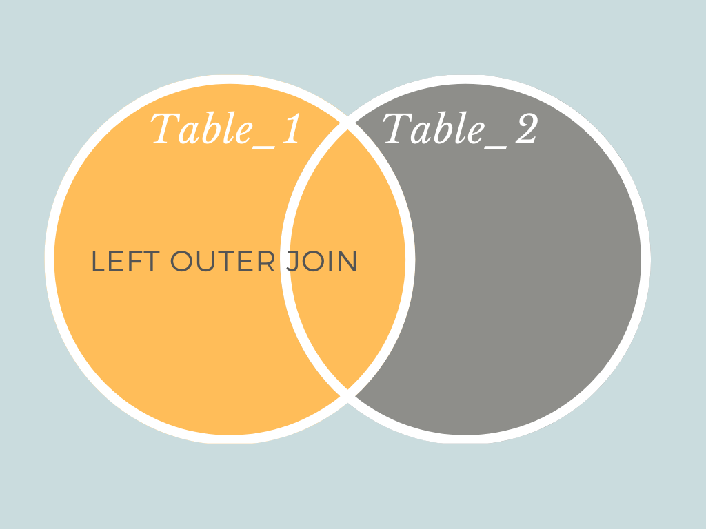

# MongoDB'de Aggregation Pipeline Stage Kullanımı (MongoDB Öğreniyoruz 6)

Burada amaç gruplama, toplam, ortalama alma, verileri birleştirme vb dokümanları kümelme ve bu kümeler üzerinde işlemler yapmayı ifada eder.

MongoDB bu tarz işlemlerin tümü için Aggregation Pipeline tabirini kullanır. Bu pipeline'lar farklı stage'lerden oluşur. Her bir stage işini tamamladıktan sonra veriyi bir sonki stage'e devreder. 


Birde aggregation pipeline operator kavramı var. Bu da aslında stage'ler içinde kullanılan expression'larda kullanılır.

- Bütün Aggregation Pipeline Stage'leri görmek ve [incelemek için](https://www.mongodb.com/docs/manual/reference/operator/aggregation-pipeline/) şu linki kullanınız.
- Bütün Aggregation Pipelie Operator'ları görmek ve incelemk için [şu linki](https://www.mongodb.com/docs/manual/reference/operator/aggregation/) kullanınız. 


Örneğin $lookup bir stage iken avg,sum veya count ise bir operator'dur.

Örneklerle daha iyi anlayacağız.

Basit bir örnekle giriş yapalım. Örneği [şu sayfada](https://www.mongodb.com/docs/manual/core/aggregation-pipeline/) bulabilirsiniz.

```javascript
// verileri kaydediyoruz

db.orders.insertMany( [
   { _id: 0, name: "Pepperoni", size: "small", price: 19,
     quantity: 10, date: ISODate( "2021-03-13T08:14:30Z" ) },
   { _id: 1, name: "Pepperoni", size: "medium", price: 20,
     quantity: 20, date : ISODate( "2021-03-13T09:13:24Z" ) },
   { _id: 2, name: "Pepperoni", size: "large", price: 21,
     quantity: 30, date : ISODate( "2021-03-17T09:22:12Z" ) },
   { _id: 3, name: "Cheese", size: "small", price: 12,
     quantity: 15, date : ISODate( "2021-03-13T11:21:39.736Z" ) },
   { _id: 4, name: "Cheese", size: "medium", price: 13,
     quantity:50, date : ISODate( "2022-01-12T21:23:13.331Z" ) },
   { _id: 5, name: "Cheese", size: "large", price: 14,
     quantity: 10, date : ISODate( "2022-01-12T05:08:13Z" ) },
   { _id: 6, name: "Vegan", size: "small", price: 17,
     quantity: 10, date : ISODate( "2021-01-13T05:08:13Z" ) },
   { _id: 7, name: "Vegan", size: "medium", price: 18,
     quantity: 10, date : ISODate( "2021-01-13T05:10:13Z" ) }
] )


// Adına göre her bir pizzanı kaç adet order edildiğini hesaplıyoruz

db.orders.aggregate( [
   // Stage 1: Filter pizza order documents by pizza size
   {
      $match: { size: "medium" }
   },
   // Stage 2: Group remaining documents by pizza name and calculate total quantity
   {
      $group: { _id: "$name", totalQuantity: { $sum: "$quantity" } }
   }
] )


// [
//   { _id: 'Pepperoni', totalQuantity: 20 },
//   { _id: 'Cheese', totalQuantity: 50 },
//   { _id: 'Vegan', totalQuantity: 10 }
// ]


```

- Stage 1 de öncelikle veriler filtreleniyor. $match operatörünün buradaki görevi standrt SQL'deki where clause gibidir.

- Stage 2 de ise dokümanları adına göre gruplandırılıpp her bir grubun quantity'si toplanıyor.

Dikkaet etmemiz gerekn konulardan biri sorgu içinde dokümanın alanları çağrılırken başına $ işareti kullanılıyor olması diğeri ise bu sorgu aslında ortaya yeni dokümanlar oluşturuyor olması.
Örneğin ortaya öıkan dokümanın _id alanı normal dokümanın name alanında oluşuyor ayrıca totalQuantity adında yeni alan oluşturulup toplam buraya yazılıyor.


Şimdi bazı aggregation pipeline state'leri beraber inceleyelim. Bütün aggregation stage'leri görmek için [şu sayfayı](https://www.mongodb.com/docs/manual/reference/operator/aggregation-pipeline/) ziyaret ediniz.


## Aggregation Pipeline Stages

UYARI : Örnekleri yaparken karışıklık yaşamamanız için bir önceki örnekte olşturduğunuz collecitonları siliniz.

```javascript


//collection_name yerine ilgili collaction'ın adını yazınız.

db.collection_name.drop()

```


- **$group**: Group key'e göre dokümanları gruplandırır.[ Accumulator operatörleri](https://www.mongodb.com/docs/manual/reference/operator/aggregation/group/#accumulator-operator) ile birlikte kullanılır.


Örneğin alttaki sorgu satışların toplamını hesaplamaktadır. Burada $count bir accumulator'dür.

```javascript
db.sales.aggregate( [
  {
    $group: {
       _id: null,
       count: { $count: { } }
    }
  }
] )


//sonuç

{ "_id" : null, "count" : 8 }

```

Alttaki sorgu satışlardaki bütün ürünleri tekil olarak dondürür. Yani ürünleri distinct yapmış olur.

```javascript
db.sales.aggregate( [ { $group : { _id : "$item" } } ] )
```

Standart SQL'deki group by ve having kullanımına bir örnek. $group operatorü içinde $sum accumulator'ü kullanılarak oluşan totalSaleAmount alanı $match stage'inde (having) filtrelenmiş. 
```javascript

db.sales.aggregate(
  [
    // First Stage
    {
      $group :
        {
          _id : "$item",
          totalSaleAmount: { $sum: { $multiply: [ "$price", "$quantity" ] } }
        }
     },
     // Second Stage
     {
       $match: { "totalSaleAmount": { $gte: 100 } }
     }
   ]
 )

```

- **$lookup**: Unsharted ve aynı vertabanındaki collection'lar için left outer join işlemi yapar. Hiç SQL bilmeyenler için basitçe alttaki şekilde gösterildiği gibidir. Yani iki tablonun/collection'ın belli bir alana göre kesişimi de dahil olmak üzere tablolardan birinin verilerini/dokümanlarını ifade eder. Versiyon 5.1'den itibaren shareded collection üzerinde from parametresini desteklemey başlamıştır.



[Resim Kaynak](https://towardsdatascience.com/what-is-the-difference-between-an-inner-and-an-outer-join-in-sql-5b5ec8277377)

MongoDb tarafından bakaack olursak, kitaplar ve bu kitapların yayınevlerinin olduğu iki collection'ınımız olsun. Verilerin tekrar etmemesi için kitapevlerinin kitaplar  içinde refererenced doküman olarak kaydetmiş olalım. Kitapları çekerken yayınevlerinin sadece _id alanını değil aynı zamanda adını da çekmek istrsek $lookup kullanmak durumundayız.

Bu arada MongoDB sadece Left Outer Join destekler. Diğer bütün join işlemlerini MOngoDb'nin diğer yetenekleri ve left outer join desteğini kullanarak yapmalıyız.

**Tek bir alana göre birlişim**

```javascript
{
   $lookup:
     {
       from: hangi_collection_ile_bileşilecek,
       localField: üzerinde_calistigimiz_collecitondaki_key,
       foreignField: from_alanında_belirtttğimiz_diger_collectindaki_eslesecek_key,
       as: ciktida_ureticelcek_arrayin_adi
     }
}

```
Örnek

```javascript

db.orders.insertMany( [
   { "_id" : 1, "item" : "almonds", "price" : 12, "quantity" : 2 },
   { "_id" : 2, "item" : "pecans", "price" : 20, "quantity" : 1 },
   { "_id" : 3  }
] )


db.inventory.insertMany( [
   { "_id" : 1, "sku" : "almonds", "description": "product 1", "instock" : 120 },
   { "_id" : 2, "sku" : "bread", "description": "product 2", "instock" : 80 },
   { "_id" : 3, "sku" : "cashews", "description": "product 3", "instock" : 60 },
   { "_id" : 4, "sku" : "pecans", "description": "product 4", "instock" : 70 },
   { "_id" : 5, "sku": null, "description": "Incomplete" },
   { "_id" : 6 }
] )


// örnek: orders colleciton'ı kendi üzerindek item alanı ile inventory collection'ı üzerindeki sku alanı arasında ilişki kurulmuş

db.orders.aggregate( [
   {
     $lookup:
       {
         from: "inventory",
         localField: "item",
         foreignField: "sku",
         as: "inventory_docs"
       }
  }
] )


// sonuç


{
   "_id" : 1,
   "item" : "almonds",
   "price" : 12,
   "quantity" : 2,
   "inventory_docs" : [
      { "_id" : 1, "sku" : "almonds", "description" : "product 1", "instock" : 120 }
   ]
}
{
   "_id" : 2,
   "item" : "pecans",
   "price" : 20,
   "quantity" : 1,
   "inventory_docs" : [
      { "_id" : 4, "sku" : "pecans", "description" : "product 4", "instock" : 70 }
   ]
}
{
   "_id" : 3,
   "inventory_docs" : [
      { "_id" : 5, "sku" : null, "description" : "Incomplete" },
      { "_id" : 6 }
   ]
}


```
Standart SQL'deki karşılığı

```sql
SELECT *, inventory_docs
FROM orders
WHERE inventory_docs IN (
   SELECT *
   FROM inventory
   WHERE sku = orders.item
);

```

**İki ilişkili collection üzerinde tek bir ala üzerindeki eşitlikler dışında condition tanımlama**

Burada iki tablo arasında bir ilişki var (correlated). Aralarında referenced ilişki yok ancak item ve stock_item alanları arasında ilişki var.

```javascript
{
   $lookup:
      {
         from: hangi_collection_ile_bileşilecek,
         let: { <var_1>: <expression>, …, <var_n>: <expression> }, // pipeline da kullanılacak değişkenler tanımlanır. opsiyonel
         pipeline: [ <pipeline to run on joined collection> ], //dokuman alanlarına let kısmında tanımlanan alanlar yardımıyla ulaşır. join işlemleri burada yapılır.
         as: ciktida_ureticelcek_arrayin_adi // çoıktıya verilek isim
      }
}

```
Örnek

```javascript
db.orders.insertMany( [
  { "_id" : 1, "item" : "almonds", "price" : 12, "ordered" : 2 },
  { "_id" : 2, "item" : "pecans", "price" : 20, "ordered" : 1 },
  { "_id" : 3, "item" : "cookies", "price" : 10, "ordered" : 60 }
] 


db.warehouses.insertMany( [
  { "_id" : 1, "stock_item" : "almonds", warehouse: "A", "instock" : 120 },
  { "_id" : 2, "stock_item" : "pecans", warehouse: "A", "instock" : 80 },
  { "_id" : 3, "stock_item" : "almonds", warehouse: "B", "instock" : 60 },
  { "_id" : 4, "stock_item" : "cookies", warehouse: "B", "instock" : 40 },
  { "_id" : 5, "stock_item" : "cookies", warehouse: "A", "instock" : 80 }
] )


// order collection ı üzerine warehose daki stok sayısı order edatına eşit veya daha fazla olan wharehouseları stock adeti ile birlikte birliştir. 


db.orders.aggregate( [
   {
      $lookup:
         {
           from: "warehouses",
           let: { order_item: "$item", order_qty: "$ordered" }, // order collectiondaki item ile ordered alanları tanımlanıyor. çünki pipiline yani subquery de kullanılacak
           pipeline: [
              { $match:
                 { $expr: // match stage, expr i mecburen kullanır. 
                    { $and:
                       [
                         { $eq: [ "$stock_item",  "$$order_item" ] }, // let alanında tanımlanan order_item değişkenine iki $ işareti ile ulaşıyor. subquery değişkenlere bu şekild eulaşır
                         { $gte: [ "$instock", "$$order_qty" ] }
                       ]
                    }
                 }
              },
              { $project: { stock_item: 0, _id: 0 } }
           ],
           as: "stockdata"
         }
    }
] )


//Sonuç: 
{
  _id: 1,
  item: 'almonds',
  price: 12,
  ordered: 2,
  stockdata: [
    { warehouse: 'A', instock: 120 },
    { warehouse: 'B', instock: 60 }
  ]
},
{
  _id: 2,
  item: 'pecans',
  price: 20,
  ordered: 1,
  stockdata: [ { warehouse: 'A', instock: 80 } ]
},
{
  _id: 3,
  item: 'cookies',
  price: 10,
  ordered: 60,
  stockdata: [ { warehouse: 'A', instock: 80 } ]
}

```

SQL versiyonu:

```sql
SELECT *, stockdata
FROM orders
WHERE stockdata IN (
   SELECT warehouse, instock
   FROM warehouses
   WHERE stock_item = orders.item
   AND instock >= orders.ordered
);

```

**İlişkili (correlated) iki collection arasında kısa (consine) syntax ile birleşim**


```javascript

{
   $lookup:
      {
         from: hangi_collection_ile_bileşilecek,
         localField: üzerinde_calistigimiz_collecitondaki_key,
         foreignField: from_alanında_belirtttğimiz_diger_collectindaki_eslesecek_key,
         let: { <var_1>: <expression>, …, <var_n>: <expression> }, // // pipeline da kullanılacak değişkenler tanımlanır. opsiyonel
         pipeline: [ <pipeline to run> ], // dokuman alanlarına let kısmında tanımlanan alanlar yardımıyla ulaşır. join işlemleri burada yapılır. match kullanılacaksa expr kullanılmak zorunda
         as: ciktida_ureticelcek_arrayin_adi // çoıktıya verilek isim
      }
}

```
Örnek

```javascript

db.restaurants.insertMany( [
   {
      _id: 1,
      name: "American Steak House",
      food: [ "filet", "sirloin" ],
      beverages: [ "beer", "wine" ]
   },
   {
      _id: 2,
      name: "Honest John Pizza",
      food: [ "cheese pizza", "pepperoni pizza" ],
      beverages: [ "soda" ]
   }
] )


db.orders.insertMany( [
   {
      _id: 1,
      item: "filet",
      restaurant_name: "American Steak House"
   },
   {
      _id: 2,
      item: "cheese pizza",
      restaurant_name: "Honest John Pizza",
      drink: "lemonade"
   },
   {
      _id: 3,
      item: "cheese pizza",
      restaurant_name: "Honest John Pizza",
      drink: "soda"
   }
] )


//örnek : order ve restorant collection'ları üzerinde restorant adı ve içeceklerin aynı olduğu restourant order tablosuna birleştirliyor.
db.orders.aggregate( [
   {
      $lookup: {
         from: "restaurants",
         localField: "restaurant_name",
         foreignField: "name",
         let: { orders_drink: "$drink" },
         pipeline: [ {
            $match: {
               $expr: { $in: [ "$$orders_drink", "$beverages" ] }
            }
         } ],
         as: "matches"
      }
   }
] )


// sonuç

{
   "_id" : 1, "item" : "filet",
   "restaurant_name" : "American Steak House",
   "matches" : [ ]
}
{
   "_id" : 2, "item" : "cheese pizza",
   "restaurant_name" : "Honest John Pizza",
   "drink" : "lemonade",
   "matches" : [ ]
}
{
   "_id" : 3, "item" : "cheese pizza",
   "restaurant_name" : "Honest John Pizza",
   "drink" : "soda",
   "matches" : [ {
      "_id" : 2, "name" : "Honest John Pizza",
      "food" : [ "cheese pizza", "pepperoni pizza" ],
      "beverages" : [ "soda" ]
   } ]
}


```

SQL versiyonu

```sql
SELECT *, matches
FROM orders
WHERE matches IN (
   SELECT *
   FROM restaurants
   WHERE restaurants.name = orders.restaurant_name
   AND restaurants.beverages = orders.drink
);
```


**Array ile birleşim yapmak**

Sınıfa kaydolan öğrencilerin detay bilgilerini sınıf collection'ına birleştirmek. 

```javascript
db.classes.insertMany( [
   { _id: 1, title: "Reading is ...", enrollmentlist: [ "giraffe2", "pandabear", "artie" ], days: ["M", "W", "F"] },
   { _id: 2, title: "But Writing ...", enrollmentlist: [ "giraffe1", "artie" ], days: ["T", "F"] }
] )


db.members.insertMany( [
   { _id: 1, name: "artie", joined: new Date("2016-05-01"), status: "A" },
   { _id: 2, name: "giraffe", joined: new Date("2017-05-01"), status: "D" },
   { _id: 3, name: "giraffe1", joined: new Date("2017-10-01"), status: "A" },
   { _id: 4, name: "panda", joined: new Date("2018-10-11"), status: "A" },
   { _id: 5, name: "pandabear", joined: new Date("2018-12-01"), status: "A" },
   { _id: 6, name: "giraffe2", joined: new Date("2018-12-01"), status: "D" }
] )


db.classes.aggregate( [
   {
      $lookup:
         {
            from: "members",
            localField: "enrollmentlist",
            foreignField: "name",
            as: "enrollee_info"
        }
   }
] )

//sonuç olarak

{
   "_id" : 1,
   "title" : "Reading is ...",
   "enrollmentlist" : [ "giraffe2", "pandabear", "artie" ],
   "days" : [ "M", "W", "F" ],
   "enrollee_info" : [
      { "_id" : 1, "name" : "artie", "joined" : ISODate("2016-05-01T00:00:00Z"), "status" : "A" },
      { "_id" : 5, "name" : "pandabear", "joined" : ISODate("2018-12-01T00:00:00Z"), "status" : "A" },
      { "_id" : 6, "name" : "giraffe2", "joined" : ISODate("2018-12-01T00:00:00Z"), "status" : "D" }
   ]
}
{
   "_id" : 2,
   "title" : "But Writing ...",
   "enrollmentlist" : [ "giraffe1", "artie" ],
   "days" : [ "T", "F" ],
   "enrollee_info" : [
      { "_id" : 1, "name" : "artie", "joined" : ISODate("2016-05-01T00:00:00Z"), "status" : "A" },
      { "_id" : 3, "name" : "giraffe1", "joined" : ISODate("2017-10-01T00:00:00Z"), "status" : "A" }
   ]
}

```

- **\$graphLookup**: Collection üzerinde recursive search yapmak için kullanılır. Versiyon 5.1'den itibaren shareded collection üzerinde from parametresini desteklemey başlamıştır.

Syntax'i aşağıdaki gibidir.

```javascript
{
   $graphLookup: {
      from: <collection>, // hedef colection
      startWith: <expression>, // search işlemine başlanacak değeri döndürecek expression
      connectFromField: <string>, // recursive olarak dolaşırken diğer dokümana (connectToField) geçerken kullanılacak kaynak alan
      connectToField: <string>, // connectFromField alanı ile eşleşecek alan
      as: <string>, // sorgu sonunda çıkan değerlerin (array) adı
      maxDepth: <number>,  // opsiyonel, ne kadar derine gidileceğini ifade eder
      depthField: <string>, //   kaçkez recursion yapıldığını gösterecek alandır.
      restrictSearchWithMatch: <document> // opsiyonel , extra filtreleme yapmak için kullanıır. Sınırlamak için kullanılır.
   }
}
```
**Birinci örnek**: Tek doküman üzerinden graphLookup


```javascript
// employees collection'ı

{ "_id" : 1, "name" : "Dev" }
{ "_id" : 2, "name" : "Eliot", "reportsTo" : "Dev" }
{ "_id" : 3, "name" : "Ron", "reportsTo" : "Eliot" }
{ "_id" : 4, "name" : "Andrew", "reportsTo" : "Eliot" }
{ "_id" : 5, "name" : "Asya", "reportsTo" : "Ron" }
{ "_id" : 6, "name" : "Dan", "reportsTo" : "Andrew" }


// graphLookup operastonu

db.employees.aggregate( [
   {
      $graphLookup: {
         from: "employees",
         startWith: "$reportsTo",
         connectFromField: "reportsTo",
         connectToField: "name",
         as: "reportingHierarchy"
      }
   }
] )

// Sonuç olarak. Herbir çalışanın rapor verdiği çalışanlarla birlite collection olarak almış olduk.

{
   "_id" : 1,
   "name" : "Dev",
   "reportingHierarchy" : [ ]
}
{
   "_id" : 2,
   "name" : "Eliot",
   "reportsTo" : "Dev",
   "reportingHierarchy" : [
      { "_id" : 1, "name" : "Dev" }
   ]
}
{
   "_id" : 3,
   "name" : "Ron",
   "reportsTo" : "Eliot",
   "reportingHierarchy" : [
      { "_id" : 1, "name" : "Dev" },
      { "_id" : 2, "name" : "Eliot", "reportsTo" : "Dev" }
   ]
}
{
   "_id" : 4,
   "name" : "Andrew",
   "reportsTo" : "Eliot",
   "reportingHierarchy" : [
      { "_id" : 1, "name" : "Dev" },
      { "_id" : 2, "name" : "Eliot", "reportsTo" : "Dev" }
   ]
}
{
   "_id" : 5,
   "name" : "Asya",
   "reportsTo" : "Ron",
   "reportingHierarchy" : [
      { "_id" : 1, "name" : "Dev" },
      { "_id" : 2, "name" : "Eliot", "reportsTo" : "Dev" },
      { "_id" : 3, "name" : "Ron", "reportsTo" : "Eliot" }
   ]
}
{
   "_id" : 6,
   "name" : "Dan",
   "reportsTo" : "Andrew",
   "reportingHierarchy" : [
      { "_id" : 1, "name" : "Dev" },
      { "_id" : 2, "name" : "Eliot", "reportsTo" : "Dev" },
      { "_id" : 4, "name" : "Andrew", "reportsTo" : "Eliot" }
   ]
}

```

Birde iki collection'da birlite yapalım.

```javascript


// airport collection

{ "_id" : 0, "airport" : "JFK", "connects" : [ "BOS", "ORD" ] }
{ "_id" : 1, "airport" : "BOS", "connects" : [ "JFK", "PWM" ] }
{ "_id" : 2, "airport" : "ORD", "connects" : [ "JFK" ] }
{ "_id" : 3, "airport" : "PWM", "connects" : [ "BOS", "LHR" ] }
{ "_id" : 4, "airport" : "LHR", "connects" : [ "PWM" ] }

// traveler collection

{ "_id" : 1, "name" : "Dev", "nearestAirport" : "JFK" }
{ "_id" : 2, "name" : "Eliot", "nearestAirport" : "JFK" }
{ "_id" : 3, "name" : "Jeff", "nearestAirport" : "BOS" }


// graphLookup operastonu


db.travelers.aggregate( [
   {
      $graphLookup: {
         from: "airports",
         startWith: "$nearestAirport",
         connectFromField: "connects",
         connectToField: "airport",
         maxDepth: 2, // -----------------------> dikkat maxDepth 2
         depthField: "numConnections", // ------> depth sayımız burada görünecek 
         as: "destinations"
      }
   }
] )

//Sonuç

{
   "_id" : 1,
   "name" : "Dev",
   "nearestAirport" : "JFK",
   "destinations" : [
      { "_id" : 3,
        "airport" : "PWM",
        "connects" : [ "BOS", "LHR" ],
        "numConnections" : NumberLong(2) }, // --->> depth 2: PWM a bakılıyor için bağlantılar BOS ve LHR
      { "_id" : 2,
        "airport" : "ORD",
        "connects" : [ "JFK" ],
        "numConnections" : NumberLong(1) }, // --->> depth 1: ORD a bakılıyor için bağlantılar JFK
      { "_id" : 1,
        "airport" : "BOS",
        "connects" : [ "JFK", "PWM" ],
        "numConnections" : NumberLong(1) }, // --->> depth 1: BOS a bakılıyor için bağlantılar JFK ve PWM
      { "_id" : 0,
        "airport" : "JFK",
        "connects" : [ "BOS", "ORD" ],
        "numConnections" : NumberLong(0) } //--->> depth 0: Yolcu Dev'e en yakın airport JFK ilk dönüşte airport collection'ı üzerinde JFK havaalanın bağlantılı olduğu airportlar BOS ve ORD. Bir sonraki gongude bu ikisine bakılacak
   ]
}
{
   "_id" : 2,
   "name" : "Eliot",
   "nearestAirport" : "JFK",
   "destinations" : [
      { "_id" : 3,
        "airport" : "PWM",
        "connects" : [ "BOS", "LHR" ],
        "numConnections" : NumberLong(2) },
      { "_id" : 2,
        "airport" : "ORD",
        "connects" : [ "JFK" ],
        "numConnections" : NumberLong(1) },
      { "_id" : 1,
        "airport" : "BOS",
        "connects" : [ "JFK", "PWM" ],
        "numConnections" : NumberLong(1) },
      { "_id" : 0,
        "airport" : "JFK",
        "connects" : [ "BOS", "ORD" ],
        "numConnections" : NumberLong(0) } ]
}
{
   "_id" : 3,
   "name" : "Jeff",
   "nearestAirport" : "BOS",
   "destinations" : [
      { "_id" : 2,
        "airport" : "ORD",
        "connects" : [ "JFK" ],
        "numConnections" : NumberLong(2) },
      { "_id" : 3,
        "airport" : "PWM",
        "connects" : [ "BOS", "LHR" ],
        "numConnections" : NumberLong(1) },
      { "_id" : 4,
        "airport" : "LHR",
        "connects" : [ "PWM" ],
        "numConnections" : NumberLong(2) },
      { "_id" : 0,
        "airport" : "JFK",
        "connects" : [ "BOS", "ORD" ],
        "numConnections" : NumberLong(1) },
      { "_id" : 1,
        "airport" : "BOS",
        "connects" : [ "JFK", "PWM" ],
        "numConnections" : NumberLong(0) }
   ]
}
```


- **\$bucket**: gruplanacak verileri grup içinde kategorize etmek için kullanılır.

Syntax'i aşağıdaki gibidir.

```javascript

{
  $bucket: {
      groupBy: <expression>,
      boundaries: [ <lowerbound1>, <lowerbound2>, ... ], // bucket lerın sınırlarnı belirler
      default: <literal>,
      output: { // çıktığıyı düzenlemek içinmkullanılır opsiyoneldir.
         <output1>: { <$accumulator expression> },
         ...
         <outputN>: { <$accumulator expression> }
      }
   }
}

```
Örnek uygulama

```javascript

db.artists.insertMany([
  { "_id" : 1, "last_name" : "Bernard", "first_name" : "Emil", "year_born" : 1868, "year_died" : 1941, "nationality" : "France" },
  { "_id" : 2, "last_name" : "Rippl-Ronai", "first_name" : "Joszef", "year_born" : 1861, "year_died" : 1927, "nationality" : "Hungary" },
  { "_id" : 3, "last_name" : "Ostroumova", "first_name" : "Anna", "year_born" : 1871, "year_died" : 1955, "nationality" : "Russia" },
  { "_id" : 4, "last_name" : "Van Gogh", "first_name" : "Vincent", "year_born" : 1853, "year_died" : 1890, "nationality" : "Holland" },
  { "_id" : 5, "last_name" : "Maurer", "first_name" : "Alfred", "year_born" : 1868, "year_died" : 1932, "nationality" : "USA" },
  { "_id" : 6, "last_name" : "Munch", "first_name" : "Edvard", "year_born" : 1863, "year_died" : 1944, "nationality" : "Norway" },
  { "_id" : 7, "last_name" : "Redon", "first_name" : "Odilon", "year_born" : 1840, "year_died" : 1916, "nationality" : "France" },
  { "_id" : 8, "last_name" : "Diriks", "first_name" : "Edvard", "year_born" : 1855, "year_died" : 1930, "nationality" : "Norway" }
])


// aggregation


db.artists.aggregate( [
  // ===============================  First Stage
  {
    $bucket: {
      groupBy: "$year_born",                       
      boundaries: [ 1840, 1850, 1860, 1870, 1880 ], 
      default: "Other",                             // Bucket içine girmeyecek dokümanlar için id
      output: {                                     // Herbir bucket'ın çıktısı
        "count": { $sum: 1 },
        "artists" :
          {
            $push: {
              "name": { $concat: [ "$first_name", " ", "$last_name"] },
              "year_born": "$year_born"
            }
          }
      }
    }
  },
  // =============================  Second Stage
  {
    $match: { count: {$gt: 3} }
  }
] )


// First stage alttaki sonucu üretir

{ "_id" : 1840, "count" : 1, "artists" : [ { "name" : "Odilon Redon", "year_born" : 1840 } ] }
{ "_id" : 1850, "count" : 2, "artists" : [ { "name" : "Vincent Van Gogh", "year_born" : 1853 },
                                           { "name" : "Edvard Diriks", "year_born" : 1855 } ] }
{ "_id" : 1860, "count" : 4, "artists" : [ { "name" : "Emil Bernard", "year_born" : 1868 },
                                           { "name" : "Joszef Rippl-Ronai", "year_born" : 1861 },
                                           { "name" : "Alfred Maurer", "year_born" : 1868 },
                                           { "name" : "Edvard Munch", "year_born" : 1863 } ] }
{ "_id" : 1870, "count" : 1, "artists" : [ { "name" : "Anna Ostroumova", "year_born" : 1871 } ] }


// Second stage ile birlikte yani count u 3 den büyük olanlar diye bielirtilen son satırdan sonra sonuç aşağıdaki şekli alır


{ "_id" : 1860, "count" : 4, "artists" :
  [
    { "name" : "Emil Bernard", "year_born" : 1868 },
    { "name" : "Joszef Rippl-Ronai", "year_born" : 1861 },
    { "name" : "Alfred Maurer", "year_born" : 1868 },
    { "name" : "Edvard Munch", "year_born" : 1863 }
  ]
}

```

- **\$unwind** : Uygulanılan collection üzerindeki array'in her bir elemanı için ayrı bir doküman oluşturur.

```javascript
db.inventoryunwind.insertOne({ "_id" : 1, "item" : "ABC1", sizes: [ "S", "M", "L"] })

db.inventoryunwind.aggregate( [ { $unwind : "$sizes" } ] )

// sonuçda size alanındaki değerlere göre 3 farklı doküman oluşmuş oldu

{ "_id" : 1, "item" : "ABC1", "sizes" : "S" }
{ "_id" : 1, "item" : "ABC1", "sizes" : "M" }
{ "_id" : 1, "item" : "ABC1", "sizes" : "L" }

```


- **\$mergeObjects**: İki dokümanı tek bir dokümanda birleştirir.

Basit bir örneği inceleyelim.

```javascript
{
  $mergeObjects: [
    { a: 1 },
    { a: 2, b: 2 },
    { a: 3, b: null, c: 3 }
  ]
}


//sonuç: eğer bir alanın değeri daha sonraki dokümanda atanmışsa sora gelen alınır yani overwrites edilir

{ a: 3, b: null, c: 3 }

```

Daha karmaşık bir örneğe bakalım. ReplaceRoot operatörünü de bir sonraki madde de ineleyeceğiz. 

```javascript
db.orders.insertMany( [
  { "_id" : 1, "item" : "abc", "price" : 12, "ordered" : 2 },
  { "_id" : 2, "item" : "jkl", "price" : 20, "ordered" : 1 }
] )


db.items.insertMany( [
  { "_id" : 1, "item" : "abc", description: "product 1", "instock" : 120 },
  { "_id" : 2, "item" : "def", description: "product 2", "instock" : 80 },
  { "_id" : 3, "item" : "jkl", description: "product 3", "instock" : 60 }
] )


// iki collection  
db.orders.aggregate( [
   {
      $lookup: { // ========================> stage 1
         from: "items",
         localField: "item",    // field in the orders collection
         foreignField: "item",  // field in the items collection
         as: "fromItems"
      }
   },
   { //=====================================> stage 2
      $replaceRoot: { newRoot: { $mergeObjects: [ { $arrayElemAt: [ "$fromItems", 0 ] }, "$$ROOT" ] } }
   },
   { $project: { fromItems: 0 } } //========> stage 3
] )


// stage 1 in sonucunda items collection'ı order collection'a birleşmiş oldu.
[
  {
    _id: 1,
    item: 'abc',
    price: 12,
    ordered: 2,
    fromItems: [ { _id: 1, item: 'abc', description: 'product 1', instock: 120 } ]
  },
  {
    _id: 2,
    item: 'jkl',
    price: 20,
    ordered: 1,
    fromItems: [ { _id: 3, item: 'jkl', description: 'product 3', instock: 60 } ]
  }
]

// Stage 2 nin sonucunda description ile instock alanları eklenmiş oldu.
[
  {
    _id: 1,
    item: 'abc',
    description: 'product 1',
    instock: 120,
    price: 12,
    ordered: 2,
    fromItems: [ { _id: 1, item: 'abc', description: 'product 1', instock: 120 } ]
  },
  {
    _id: 2,
    item: 'jkl',
    description: 'product 3',
    instock: 60,
    price: 20,
    ordered: 1,
    fromItems: [ { _id: 3, item: 'jkl', description: 'product 3', instock: 60 } ]
  }
]


// stage 3 ile fromItems alanını sonuç sokümanından kaldırıyoruz.

[
  {
    _id: 1,
    item: 'abc',
    description: 'product 1',
    instock: 120,
    price: 12,
    ordered: 2
  },
  {
    _id: 2,
    item: 'jkl',
    description: 'product 3',
    instock: 60,
    price: 20,
    ordered: 1
  }
]

```

- **\$replaceRoot**: 

Üzerinde çaışalan dokümanı verilen dokümanla değiştirilir.


```javascript
db.collection.insertMany([
   { "_id": 1, "name" : { "first" : "John", "last" : "Backus" } },
   { "_id": 2, "name" : { "first" : "John", "last" : "McCarthy" } },
   { "_id": 3, "name": { "first" : "Grace", "last" : "Hopper" } },
   { "_id": 4, "firstname": "Ole-Johan", "lastname" : "Dahl" },
])
 
// doğrudan alttaki sorgu öalıştırılırsa hata alınır. Sebebi ise son dokümanda name alanı yok. 

db.collection.aggregate([
   { $replaceRoot: { newRoot: "$name" } }
])

// Bu nedenle alttaki gibi düzenlemeye ihtyaç var. name dokğmanı içindeki iki alanı birşetirip bir dokiman oluşturmuş olduk. daha sonta bu dokümana newRoot vermiş olduk.

db.collection.aggregate([
   { $replaceRoot: { newRoot: { $mergeObjects: [ { _id: "$_id", first: "", last: "" }, "$name" ] } } }
])

// sonuç olarak

[
  { _id: 1, first: 'John', last: 'Backus' },
  { _id: 2, first: 'John', last: 'McCarthy' },
  { _id: 3, first: 'Grace', last: 'Hopper' },
  { _id: 4, first: '', last: '' }
]

```


- **\$addFields - \$set** : Çıktıya yeni alanlkar ekler. \$set, $addFields'ın kısa  adıdır. Aynı işi yapar. Bunu update operatöründeki $set ile karıştırmayın.

```javascript

// örnek doküman
{
  _id: 1,
  student: "Maya",
  homework: [ 10, 5, 10 ],
  quiz: [ 10, 8 ],
  extraCredit: 0
}
{
  _id: 2,
  student: "Ryan",
  homework: [ 5, 6, 5 ],
  quiz: [ 8, 8 ],
  extraCredit: 8
}

// addFiled kullanımı

db.scores.aggregate( [
   {
     $addFields: {
       totalHomework: { $sum: "$homework" } ,
       totalQuiz: { $sum: "$quiz" }
     }
   },
   {
     $addFields: { totalScore:
       { $add: [ "$totalHomework", "$totalQuiz", "$extraCredit" ] } }
   }
] )

//sonuç: dikkt edilirse sonuç üzerinde total ile başlayan 3 adet alan eklenmiş oldu.

{
  "_id" : 1,
  "student" : "Maya",
  "homework" : [ 10, 5, 10 ],
  "quiz" : [ 10, 8 ],
  "extraCredit" : 0,
  "totalHomework" : 25,
  "totalQuiz" : 18,
  "totalScore" : 43
}
{
  "_id" : 2,
  "student" : "Ryan",
  "homework" : [ 5, 6, 5 ],
  "quiz" : [ 8, 8 ],
  "extraCredit" : 8,
  "totalHomework" : 16,
  "totalQuiz" : 16,
  "totalScore" : 40
}

```
- **$count**: Adet toplamını hesaplar. Aynı zamanda  operatör olarakda vardır orada accumulator olarak adlandırılır.

```javascript
// doküman

{ "_id" : 1, "subject" : "History", "score" : 88 }
{ "_id" : 2, "subject" : "History", "score" : 92 }
{ "_id" : 3, "subject" : "History", "score" : 97 }
{ "_id" : 4, "subject" : "History", "score" : 71 }
{ "_id" : 5, "subject" : "History", "score" : 79 }
{ "_id" : 6, "subject" : "History", "score" : 83 }

// score u 80 den büyük olanların sayısı

db.scores.aggregate(
  [
    {
      $match: {
        score: {
          $gt: 80
        }
      }
    },
    {
      $count: "passing_scores"
    }
  ]
)

// sonu.

{ "passing_scores" : 4 }

```

- **\$out**: Aggregatipon pipeline'dan dönen dokümanları belirtlilen collection'a yazar.

Başka bir database'e de yazabilir.


```javascript
db.books.insertMany([
   { "_id" : 8751, "title" : "The Banquet", "author" : "Dante", "copies" : 2 },
   { "_id" : 8752, "title" : "Divine Comedy", "author" : "Dante", "copies" : 1 },
   { "_id" : 8645, "title" : "Eclogues", "author" : "Dante", "copies" : 2 },
   { "_id" : 7000, "title" : "The Odyssey", "author" : "Homer", "copies" : 10 },
   { "_id" : 7020, "title" : "Iliad", "author" : "Homer", "copies" : 10 }
])


db.books.aggregate( [
    { $group : { _id : "$author", books: { $push: "$title" } } },
    { $out : "authors" }
] )


db.authors.find()

// sonuç

[
  {
    _id: 'Dante',
    books: [ 'The Banquet', 'Divine Comedy', 'Eclogues' ]
  },
  { _id: 'Homer', books: [ 'The Odyssey', 'Iliad' ] }
]

```


## SQL ile MongoDB Agrregation Fonksiyonlarının Karşılaştırılması 


|SQL Terms, Functions, and Concepts | MongoDB Aggregation Operators|
|-----------|--------------|
|WHERE| $match|
|GROUP BY |$group|
|HAVING |$match|
|SELECT| $project|
|ORDER BY |$sort|
|LIMIT|  $limit|
|SUM()| $sum| 
|COUNT()| $sum \$sortByCount|
|join |$lookup|
|SELECT INTO NEW_TABLE| $out|
|MERGE INTO TABLE | $merge (Available starting in MongoDB 4.2)|
|UNION ALL |$unionWith (Available starting in MongoDB 4.4)|
[Tablo Kaynak](https://www.mongodb.com/docs/manual/reference/sql-aggregation-comparison/)

MongoDB Sayfasında ayrıca bütün keyword'leri içeren güzel bir örnek var. Örneği de olduğu gibi buraya taşıyorum. Tablonun aslına [şu adresten](https://www.mongodb.com/docs/manual/reference/sql-aggregation-comparison/) ulaşabilirsiniz.

Örnek dokümanımız şu şekilde

```json

{
  cust_id: "abc123",
  ord_date: ISODate("2012-11-02T17:04:11.102Z"),
  status: 'A',
  price: 50,
  items: [ { sku: "xxx", qty: 25, price: 1 },
           { sku: "yyy", qty: 25, price: 1 } ]
}
```

- Bütün order'ların toplam sayısı

SQL:
```sql
SELECT COUNT(*) AS count
FROM orders
```
MongoDB:
```javascript
	
db.orders.aggregate( [
   {
     $group: {
        _id: null,
        count: { $sum: 1 }
     }
   }
] )
```

- Bütün order'ların toplam tutarı

SQL:
```sql
SELECT SUM(price) AS total
FROM orders
```
MongoDB:
```javascript
db.orders.aggregate( [
   {
     $group: {
        _id: null,
        total: { $sum: "$price" }
     }
   }
] )
```
- Herbir customer'ın ayrı ayrı toplam harcaması

SQL:
```sql
SELECT cust_id,
       SUM(price) AS total
FROM orders
GROUP BY cust_id
```
MongoDB:
```javascript
db.orders.aggregate( [
   {
     $group: {
        _id: "$cust_id",
        total: { $sum: "$price" }
     }
   }
] )
```
- Herbir customer'ın ayrı ayrı toplam harcamasının küçükten büyüğe sıralaması

SQL:
```sql
SELECT cust_id,
       SUM(price) AS total
FROM orders
GROUP BY cust_id
ORDER BY total
```
MongoDB:
```javascript
	
db.orders.aggregate( [
   {
     $group: {
        _id: "$cust_id",
        total: { $sum: "$price" }
     }
   },
   { $sort: { total: 1 } }
] )
```

- Herbir customer'ın tarihe göre gruplandırılmış tplam harcaması

SQL:
```sql
SELECT cust_id,
       ord_date,
       SUM(price) AS total
FROM orders
GROUP BY cust_id,
         ord_date
```
MongoDB:
```javascript
db.orders.aggregate( [
   {
     $group: {
        _id: {
           cust_id: "$cust_id",
           ord_date: { $dateToString: {
              format: "%Y-%m-%d",
              date: "$ord_date"
           }}
        },
        total: { $sum: "$price" }
     }
   }
] )
```
- Birden daha fazla alışveriş yapan herbir customer'ın ayrı ayrı toplam alış veriş sayısı


SQL:
```sql
SELECT cust_id,
       count(*)
FROM orders
GROUP BY cust_id
HAVING count(*) > 1
```
MongoDB:
```javascript
db.orders.aggregate( [
   {
     $group: {
        _id: "$cust_id",
        count: { $sum: 1 }
     }
   },
   { $match: { count: { $gt: 1 } } }
] )
```

- Herbir alışverişte 250 birim paradan daha fazla alış veriş yapan herbir customer'ın tarihe göre gruplandırılmış tplam harcaması

SQL:
```sql
SELECT cust_id,
       ord_date,
       SUM(price) AS total
FROM orders
GROUP BY cust_id,
         ord_date
HAVING total > 250
```
MongoDB:
```javascript
db.orders.aggregate( [
   {
     $group: {
        _id: {
           cust_id: "$cust_id",
           ord_date: { $dateToString: {
              format: "%Y-%m-%d",
              date: "$ord_date"
           }}
        },
        total: { $sum: "$price" }
     }
   },
   { $match: { total: { $gt: 250 } } }
] )
```
- Status'u A olan herbir customer'ın ayrı ayrı toplam harcaması

SQL:
```sql
SELECT cust_id,
       SUM(price) as total
FROM orders
WHERE status = 'A'
GROUP BY cust_id
```
MongoDB:
```javascript
db.orders.aggregate( [
   { $match: { status: 'A' } },
   {
     $group: {
        _id: "$cust_id",
        total: { $sum: "$price" }
     }
   }
] )
```

- Herbir alışverişte 230 birim paradan daha fazla alış veriş yapan ve status'u A olan herbir customer'ın tarihe göre gruplandırılmış toplam harcaması


SQL:
```sql
SELECT cust_id,
       SUM(price) as total
FROM orders
WHERE status = 'A'
GROUP BY cust_id
HAVING total > 250
```
MongoDB:
```javascript
	
db.orders.aggregate( [
   { $match: { status: 'A' } },
   {
     $group: {
        _id: "$cust_id",
        total: { $sum: "$price" }
     }
   },
   { $match: { total: { $gt: 250 } } }
] )
```
- Herbir customer'ın her alışverite altdıkları ürünlerin toplamı


SQL:
```sql
SELECT cust_id,
       SUM(li.qty) as qty
FROM orders o,
     order_lineitem li
WHERE li.order_id = o.id
GROUP BY cust_id
```
MongoDB:
```javascript
db.orders.aggregate( [
   { $unwind: "$items" },
   {
     $group: {
        _id: "$cust_id",
        qty: { $sum: "$items.qty" }
     }
   }
] )
```

- Tarih ve customer'a göre gruplandırılmış alışverişlerin toplamı (tarihinde gruplandırmaya dahil edilmesiyle aslında her bir alış verişi tekil olarka saymış oluyoruz.)

SQL:
```sql
SELECT COUNT(*)
FROM (SELECT cust_id,
             ord_date
      FROM orders
      GROUP BY cust_id,
               ord_date)
      as DerivedTable
```
MongoDB:
```javascript
db.orders.aggregate( [
   {
     $group: {
        _id: {
           cust_id: "$cust_id",
           ord_date: { $dateToString: {
              format: "%Y-%m-%d",
              date: "$ord_date"
           }}
        }
     }
   },
   {
     $group: {
        _id: null,
        count: { $sum: 1 }
     }
   }
] )
```


Son olarak MongoDB resmi sayfasında çok detaylı anlatım olan ve best practice'leride içeren "[Practical MongoDB Aggregation (Ebook)](https://www.practical-mongodb-aggregations.com/)" dokümanını kesinlikle okuyunuz.


# Kaynakalar
- 

- https://www.mongodb.com/docs/manual/reference/operator/aggregation-pipeline/
- https://www.mongodb.com/docs/manual/reference/operator/aggregation/
- https://www.practical-mongodb-aggregations.com/