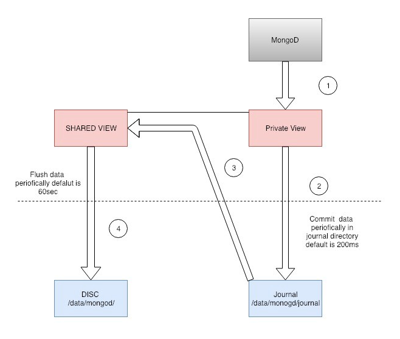
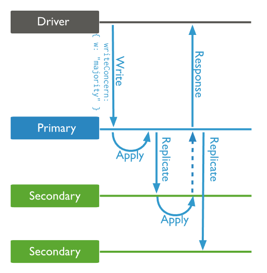
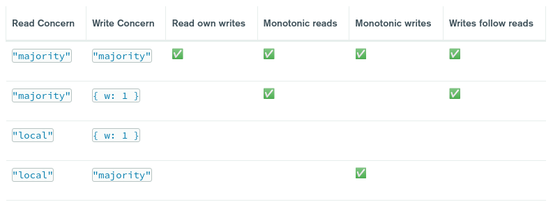
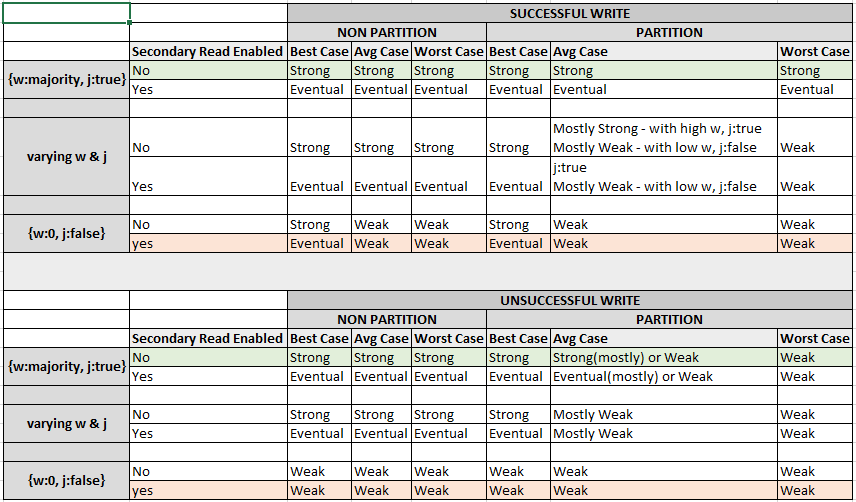
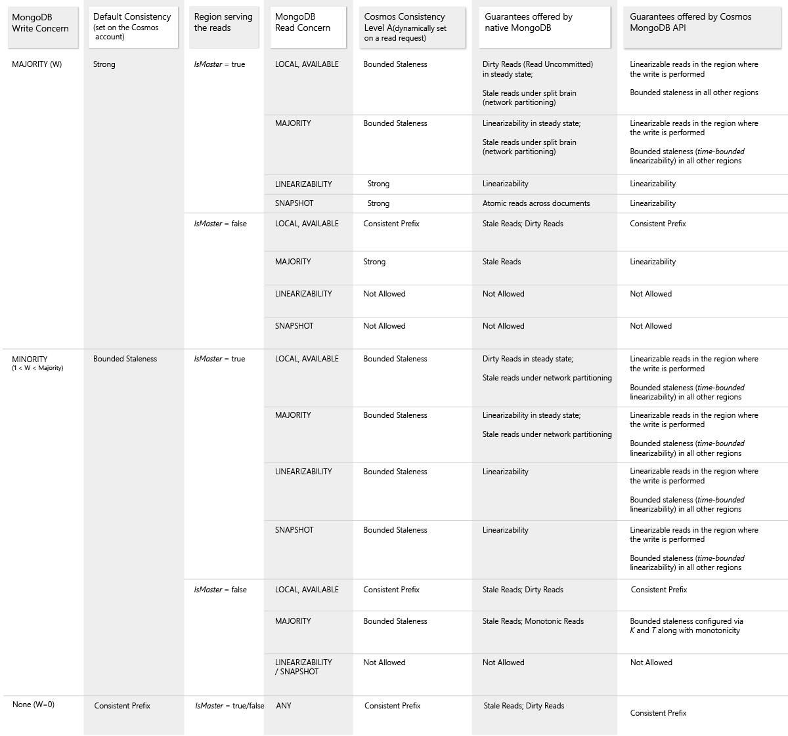
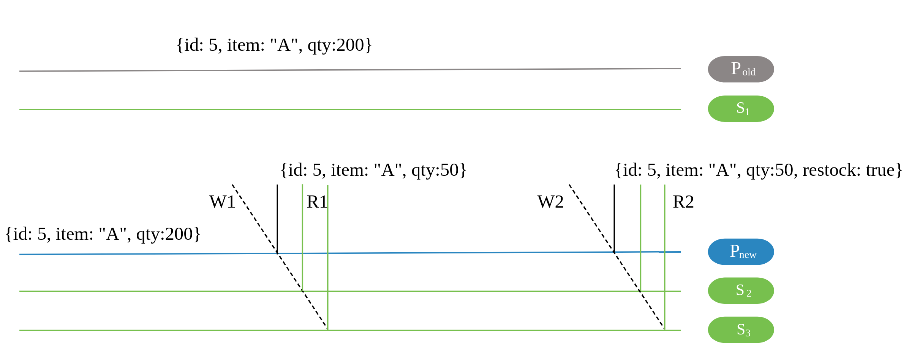
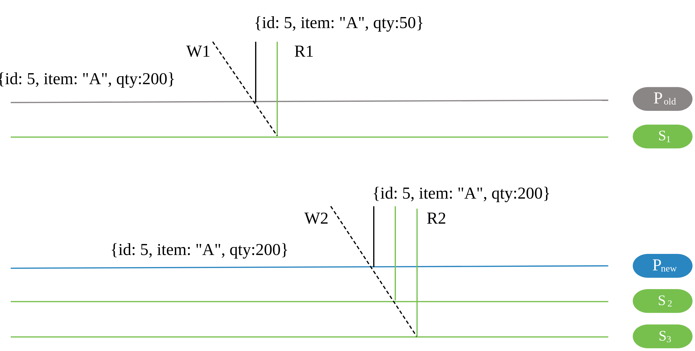

# MongoDB' de Transaction Yönetimi (MongoDB Öğreniyoruz 8)

Merhaba arkadaşlar

MongoDB'de bir doküman üzerinde yapılan işlemler atomiktir. Yani bir belge üzerinde yaptığınız örneğin bir update işleminde doküman ya tamamen update edilir yada edilmez. Burada amaç doküman üzerindeki array'lar, embedded dokümanlar veya referenced dokümanların bir bütün olarak değerlendirilmesidir. Bundan dolayı da zaten pratikte tabiri caizse mümkün olduğunca relation'a çok bulaşmamak en iyisi. Ancak tabii ki gerçek hayatta her şeyi tek collection'a sığdırmak imkansız.

Neyse ki MongoDB single document transaction yanı sıra multi-document transaction'ı da destekler. Ayrıca distributed transaction'ı da destekler. Üstelik transaction multiple operation, collection, database, document ve shard üzerinde gerçekleştirilebilir.

Makale serisinin diğer yazıları için alttaki linkleri kullanabilirsiniz.
- [Distributed Sistemlerde Consistency Kavramı ve Document DB Karşılaştırmaları (MongoDB Öğreniyoruz 1)](1.distributed-systems.md)
- [MongoDB Kurulum ve CRUD İşlemleri (MongoDB Öğreniyoruz 2)](2.kurulum-crud-islemleri.md)
- [MongoDB'de Embedded, Referenced Document ve Relation Kavramları (MongoDB Öğreniyoruz 3)](3.embedded-ve-referenced-doküman.md)
- [MongoDB'de Detaylı Sorgulama/Querying (MongoDB Öğreniyoruz 4)](4.query-detaylari.md)
- [MongoDB'de Index Kullanımı ve Sorgu Optimizasyonu (MongoDB Öğreniyoruz 5)](5.indekslerle-calisma-optimizasyon.md)
- [MongoDB'de Aggregation Pipeline Stage Kullanımı (MongoDB Öğreniyoruz 6)](6.aggregation-stages.md)
- [MongoDB'de Aggregation Pipeline Operation Kullanımı ve Sorgu Optimizasyonu  (MongoDB Öğreniyoruz 7)](7.aggregation-operations.md)
- [MongoDB' de Transaction Yönetimi (MongoDB Öğreniyoruz 8)](8-transaction.md)
- [MongoDB' de Role Tabanlı Yetkilendirme (MongoDB Öğreniyoruz 9)](9.security.md)
- [MongoDB'de Büyük Obje ve Dosyaların GridFS ile Yönetimi(MongoDB Öğreniyoruz 10)](10.gridfs-file-management.md)


Örneklere geçmeden önce transaction başlatırken ayarlayabileceğimiz opsiyonları ve yönetmemiz gereken hata tiplerini inceleyelim.


Öncelikle MongoDB'de programlama dillerinde kullanacağımız driver'larda iki adet API (core ve callback) var. 

- [Callback API](https://www.mongodb.com/docs/manual/core/transactions-in-applications/#callback-api-vs-core-api)
  Transaction'ı başlatır ilgili operasyonları çalıştırır ve hata olmaması durumunda kendisi otomatik olarak commit yapar. Ayrıca hata durumlarını kendisi yönetebilir.
- [Core API](https://www.mongodb.com/docs/manual/core/transactions-in-applications/#callback-api-vs-core-api)'de ise
  Transaction'ı açıkça  başlatmak, commit ve rollback işlemlerini de manuel yapmak zorundayız. Ayrıca hata durumlarını da yönetmemiz gerekiyor. Pratiklik açısından rollback iyi görünse de core API de esneklik sunmaktadır. Örneğin yukarıda shell üzerinde gördüğümüz örnek core API kullanmaktadır.


Transaction işlemlerinde iki tip hata fırlatılmaktadır. 

-  **TransientTransactionError**: Eğer callback API kullanıyorsak ve  transaction esnasında bu hata ile karşılaşılırsa sistem bütün transaction'ı yeniden başlatır.
-  **UnknownTransactionCommitResult**: Eğer Eğer callback API kullanıyorsak ve  transaction esnasında bu hata ile karşılaşılırsa sistem commit işlerimi tekrar dener.


Ayrıca transaction konuşacaksak consistency kavramından da biraz bahsetmek gerekiyor. Serinin ilk yazısında veritabanlarını karşılaştırırken MongoDb'nin [Strong consistency](https://en.wikipedia.org/wiki/Consistency_model) yapısı olduğunu söylemiştik. Yani verinin tutarlılığına çok önem veriyor. Strong consistency'nin de farklı seviyeleri mevcut.


Transaction'un içinde yapılan operasyonların ve transaction'ının tamamlanması için bazı şartlar var. Bunlar genellikle default ayarlarıyla kullanılır ancak ihtiyaçlarımıza göre değiştirme şansımız var.

Doğru yapılacak read ve write concern ayarları ile beklentilerimizi karşılayacak consistency ve availability seviyesini ayarlayabiliriz. 

-  **Transaction-level read concern (read isolation)** : Okumaya çalıştığımız veri üzerinde izolasyon ve cocnsistency özelliklerini ayarlamamızı sağlar.
   -  **Local**: Verinin bütün node'lara yazıldığının garantisi olmaksızın node'lardan veri getirir. Yazma işlemi devam ederken okuma yapılması durumunda okuduğumuz verinin garantisi yoktur yani veri rollback yapılabilir.[Local sayfasında](https://www.mongodb.com/docs/manual/reference/read-concern-local/#mongodb-readconcern-readconcern.-local-) çok detaylı bilgi bulabilirsiniz.
   -  **Available**: Local seviyesi gibidir.  Sharded cluster'larda en hızlı okumayı sağlar ancak bunu da bir maliyeti vardır. Bozuk veri gelme olasılığı vardır (örneğin [orphan document](https://www.mongodb.com/docs/manual/reference/glossary/#std-term-orphaned-document)). Unsharded ortamlarda local ile available aynı şekilde davranır.
   -  **Majority**: (Default değer) Okunan  verinin cluster node'larının önemli bir kısmı tarafından onaylanmış ve rollback yapılmayacağının garantisi olan veri olduğunu ifade eder. Tabii ki burada özellikle sharded cluster'larda performans kaybı olacaktır. Performansı hızlandırmak için [şu dokümana](https://www.mongodb.com/docs/manual/tutorial/mitigate-psa-performance-issues/#std-label-performance-issues-psa) göz atabilirsiniz.
   -  **Linearizable**: Cluster'ın bütün node'ları tarafından onaylanmış verilerin döndürülmesini sağlar.
   -  **Snaphot**: MongoDb versiyon 5 ile gelen özelliktir ve multi document transaction'larda kullanınılır. Snapshot, serializable bir transaction'da bütün işlemlerin bir transaction'da yapılması ve bu sırada ilgili kaydın/kayıtların kilitlenmesi aynı veri üzerinde işlem yapılmasını engellemesi sebebiyle dağınık yapıdaki veritabanlarında kullanılmaktadır. Ancak birçok ilişkisel veritabanı da yeni versiyonlarında bu problemi çözmek amacıyla snapshot izolasyonu desteklemeye başlamışlarıdr. ACID prensiplerindeki I izolasyonu ifade etmektedir.MongoDB bunu iki farklı şekilde yapar. Transaction durumunda yapılan işlemler verinin bir snapshot'ı alınarak yapılır. Bu esnada asıl veri üzerinde diğer oturumlar okuma veya yazma yapabilirler (tabi bu veritabanının yeteneklerine göre kısıtlanabilir). Snapshot üzerinde işlemler tamamlandığında eğer verinin ilk alınmasında sonra değişikliğe uğramadıysa veri kaydedilir (transaction commit), eğer bu arada veri değiştiyse transaction conflict gerekçesiyle iptal edilir. Daha fazla detay almak için [şu sayfayı](https://www.mongodb.com/docs/manual/reference/read-concern-snapshot/#mongodb-readconcern-readconcern.-snapshot-) ziyaret ediniz.
-  **Transaction-level write concern (write acknowledgement)** :  Yazma işlemi yapıldıktan sonra MongoDB yazma işlemi hakkında bilgi (acknowledgement) dönmektedir. Dönülecek bilgide neleri beklediğimizi daha doğrusu sunucunun yazma işlemini belli bir timeout süresi içinde hangi level'da yapacağını belirlememiz sağlıyor. Özellikle bir cluster yapımız varsa bu ayarı beklentilerimizi karşılayacak şekilde yapmamız çok önemli.
   -  **w**: Yazma işleminin cluster yapıda kaç node'a yayıldığının onayını istediğimiz seçenektir. eğer "0" dersek bir onay istemediğimiz anlamına gelir. Yani "fire and forget" gönder ve unut. "1" dersek replica set üzerinde primary üzerine yazılması onayını istemiş oluruz. 1'den büyük vereceğimiz her değer kaç adet secondary'ye kaydolması gerektiğinin onayını almamızı sağlar. Eğer rakam yerine majority yazarsak (ki bu default değerdir) bütün sunuculara yazıldığının onayını almış oluruz. 
   -  **j**: bu opsiyonu anlamak için öncelikle journaling kavramını anlamak gerekiyor. Journaling yazma işlemi sisteme geldiğinde (vakit alacağı için) gerçek yazma işlemini yapmadan önce yapılacak işlemin disk üzerine loglanması işlemidir. Daha fazla detay için [şu linki](https://www.mongodb.com/docs/manual/tutorial/manage-journaling) ziyaret ediniz. Amaç bir crash anında verinin korunmasını sağlamak ve bazı durumlarda hız sağlamak içindir. Eğer bu değer false olarak ayarlanırsa journaling prosesi onayı istememiş oluruz. Şunu da bilmemiz gerekiyor bunu true bile yapsak replica set primary'nin crash olması durumunda transaction'ın roll back yapılmayacağı anlamına gelmez. Sharded cluster'da bu parametrenin default değeri false olarak işaretlidir.



[resim kaynak](https://sauravomar01.medium.com/journalling-in-mongodb-eff866ac9712)
   -  **wtimeout**: w değeri birden büyük bir değere sahip olduğunda çalışır. Belirlenen süre içinde yazma işlemi tamamlanmazsa (eventully tamamlansa bile) hata döner. Ancak belirtilen süre içinde başarılı yapılan değişiklikler geri alınmaz. w parametresinden belirtilen bütün node'lardan gelen dönüş zamanaı dikkate alınır yani sadece primary'ye bakılmaz.

Replicaset üzerinde write concern örneği.


-  **Transaction-level read preference** :   Okuma işlemninin hangiş sunucu tarafından karşılanacağını ayaralamk için kullanılır. Default değer olarak primary ayarlıdır.
   -  **primary**: Primary'den okunur. Multi document transaction yapılırken primary olmalıdır.
   -  **primaryPreferred**: Önce primary o yoksa secondary.
   -  **secondary**: Secondary'den okunur.
   -  **secondaryPreferred**: Önce secondary o yoksa secprimaryondary.
   -  **nearest**: Rastgele seçim yapılır. Bu rastgelelik okadar da rastgele değil tahmin edebileceğiniz gibi. Detaylar için [şu sayfayı](https://www.mongodb.com/docs/manual/core/read-preference/#mongodb-readmode-nearest) ziyaret ediniz.


Dikkat etmemiz gereken bazı kısıtlar var.

- Versiyon 4.2 ve öncesinde Transaction içinde collection oluşturamayız. 4.4 den itibaren oluşturmak mümkün artık. Ancak bu halen cross shard ortamlarda mümkün değil. Detaylar için [şu sayafayı](https://www.mongodb.com/docs/manual/core/transactions/#create-collections-and-indexes-in-a-transaction) ziyaret ediniz.
- Cross-shard olmasa dahi farklı shard'larda collection oluşturulamaz.
- non-CRUD ve no-informational işlemler yapılamaz. Örneğin kullanıcı oluşturmak, count almak vb. 
- Multi document transaction'da desteklenenen operasyonlar ve detayları için [şu linki](https://www.mongodb.com/docs/manual/core/transactions-operations/#operations-supported-in-multi-document-transactions) ziyaret ediniz.


Daha önce de belirttiğimiz üzere MongoDB shell NodeJS'le tam uyumlu olduğu için dokümanları takip  ederken dil olarak NodeJS seçerek örnekleri MongoDB Shell üzerinde de yapmak mümkün.
Örneklerde dil seçeneklerinde shell olmasa da [şu sayfada](https://www.mongodb.com/docs/manual/core/transactions-in-applications/#std-label-txn-mongo-shell-example) shell örneğini bulmak mümkün.

İleride örneklerle daha da detaylı inceleyeceğiz. Aşağıda sadece ufak bir shell örneğini nasıl birşeyle karşılaşacağımız hakkında fikir vermesi adına paylaşıyorum. 

```javascript

// Collection oluşturuluyor.
db.getSiblingDB("mydb1").foo.insertOne(
    {abc: 0},
    { writeConcern: { w: "majority", wtimeout: 2000 } }
)
db.getSiblingDB("mydb2").bar.insertOne(
   {xyz: 0},
   { writeConcern: { w: "majority", wtimeout: 2000 } }
)

// Session başlatılıyor. 
session = db.getMongo().startSession( { readPreference: { mode: "primary" } } );
coll1 = session.getDatabase("mydb1").foo;
coll2 = session.getDatabase("mydb2").bar;


// Transaction başlatılıyor. read ve write concern opsiyonlarına dikkat ediniz.
session.startTransaction( { readConcern: { level: "local" }, writeConcern: { w: "majority" } } );


// Farklı iki collection üzerinde doküman kaydediliyor.
try {
   coll1.insertOne( { abc: 1 } );
   coll2.insertOne( { xyz: 999 } );
} catch (error) {

// Hata olması durumunda transaction abort ediliyor.
   session.abortTransaction();
   throw error;
}

// transaction'ı commit'liyoruz.
session.commitTransaction();
session.endSession();

```


MongoDB'de causally consistent client session ile farklı seviyelerde causal consistence guarantee sağlanabilir. Consistency kavramı hakkında bilginiz yetersizse bu makale serisinin ilk yazısını okuyabilirsiniz.


[resim kaynak](https://www.mongodb.com/docs/manual/core/causal-consistency-read-write-concerns/)

Faydalanabileceğiniz diğer bir tablo da ise başarılı ve başarısız yazma işlemi durumlarında consistency'nin ne kadar kuvvetli olduğunu görebilirsiniz. 

[resim kaynak](https://dzone.com/articles/mongodb-consistency-levels-cappaclec-theorem)


Bildiğiniz üzere Microsoft Azure Cosmos DB MongoDB API'si de sunmaktadır. Consistency seviyelerin native MongoDB ile karşılaştırmak için de alttaki tabloyu kullanabilirsiniz. Aynı zamanda native MongoDB consistency seviyelerini de verdiği için ekledim. 


[resim kaynak](https://docs.microsoft.com/en-us/azure/cosmos-db/mongodb/consistency-mapping)


## Senaryolar Üzerinden Causal Consistency

Senaryolara MongoDB'nin resmi sayfasında [şu linkten](https://www.mongodb.com/docs/manual/core/causal-consistency-read-write-concerns/#scenarios) ulaşabilirsiniz.

- **Senaryo 1: Read Concern "majority" and Write concern "majority"**

üstte verdiğimiz tabloya bakacak olursak böyle bir opsiyon ayarı bize Read own writes, Monotonic reads, Monotonic writes,  Writes follow reads garantilerinin hepsini verecektir. Bu kavramlar hakkında bilginiz yoksa yazı serisinin ilk makalesini okuyunuz. 



şekildeki örneği inceleyecek olursak.

- S1 oturumunda yeni bir değer girilmiş ve quantity 200 olarak kaydedilmiş.
- S2 oturumu ile quantity değeri W1 ile  50 olarak atanmış.
- Yine S2 oturumu ile W1'de yazılan değer R1 ile okunmuş (Read on writes).
- S3 oturumu ile W2'de A item'ı restock değeri true olarak update edilmiş (Monotonic writes,  Writes follow reads).
- Yine S3 oturumu ile R2'de A item'ı okunmuş (Read on writes, Monotonic reads)


- **Senaryo 2: Read Concern "local" and Write concern {w: 1}**

üstte verdiğimiz tabloya bakacak olursak böyle bir opsiyon ayarı bize Read own writes, Monotonic reads, Monotonic writes,  Writes follow reads garantilerinin hiçbirini veremeyecektir.



- Read 2, Write 1'i ve ardından Write 2'yi değil, yalnızca Write 2'den sonraki bir durumu yansıtan S 3'ten verileri okur. Yani Read own writes sağlanmamış olur.
- Read 2, Read 1'den sonraki bir durumu yansıtmayan S3'ten verileri okur (yani daha önceki bir durum, Read 1 tarafından okunan verileri yansıtmaz). Yani Monotonic reads sağlanamamış olur.
- Write 2, Write 1'deki değişimi okumadan verinin ilk halini değiştirmektedir. Yani  Monotonic writes sağlanmamış olur.
- Write 2 verinin ilk halini Write 1 den sonra Read 1 değerini görmeden yapar. Yani Write follow read sağlanmamış olur.

## Sharded Replicated Ortamda Transaction Örnekleri

Burada hızlıca oluşturacağız ancak sharded veritabanı ve collection oluşturma konusunda daha detaylı bilgi almak isterseniz serinin ikinci makalesini (MongoDB Kurulum, Konfigürasyon ve Basit CRUD işlemleri) okuyabilirsiniz.


Burada hızlıca oluşturacağız.


```javascript

//sharded veritbanı oluşturuldu
sh.enableSharding("myshardeddb")

use myshardeddb


// schema üzerinden de transaction örneği yapmak için schema ile birlikte collection oluşturuyoruz.

db.createCollection("students", {
   validator: {
      $jsonSchema: {
         bsonType: "object",
         required: [ "name", "year", "major", "address" ],
         properties: {
            name: {
               bsonType: "string",
               description: "must be a string and is required"
            },
            year: {
               bsonType: "int",
               minimum: 2017,
               maximum: 3017,
               description: "must be an integer in [ 2017, 3017 ] and is required"
            },
            major: {
               enum: [ "Math", "English", "Computer Science", "History", null ],
               description: "can only be one of the enum values and is required"
            },
            gpa: {
               bsonType: [ "double" ],
               description: "must be a double if the field exists"
            },
            address: {
               bsonType: "object",
               required: [ "city" ],
               properties: {
                  street: {
                     bsonType: "string",
                     description: "must be a string if the field exists"
                  },
                  city: {
                     bsonType: "string",
                     description: "must be a string and is required"
                  }
               }
            }
         }
      }
   }
})


// oluşturduğumuz collection ı  sharded yapıyoruz
sh.shardCollection("myshardeddb.students", { _id: 1 } )

// diğer collection
sh.shardCollection("myshardeddb.teachers", { _id: 1 } )

```

Öncelikle Students tablosuna biraz doğru kayıt girelim.

```javascript

db.students.insertMany( [{name: "Alice", year: Int32( 2020 ), major: "English", gpa: Double( 3.0 ), address: {
      city: "NYC",
      street: "33rd Street"
   }},

{name: "Alice2", year: Int32( 2019 ), major: "History", gpa: Double( 5.0 ), address: {
      city: "NYC",
      street: "33rd Street"
   }}
])
```

Verilerimizi kontrol edelim.

```javascript
db.students.find({}).pretty();


// [
//   {
//     _id: ObjectId("62ee7ececa31592b7274f60f"),
//     name: 'Alice',
//     year: 2020,
//     major: 'English',
//     gpa: 3,
//     address: { city: 'NYC', street: '33rd Street' }
//   },
//   {
//     _id: ObjectId("62ee7ececa31592b7274f610"),
//     name: 'Alice2',
//     year: 2019,
//     major: 'History',
//     gpa: 5,
//     address: { city: 'NYC', street: '33rd Street' }
//   }
// ]


```

- İlk örneğimizde transaciton içinde bir doküman kaydedip daha sonra abord edeceğiz.


```javascript

session = db.getMongo().startSession();
studentCollection = session.getDatabase("myshardeddb").students;

session.startTransaction();


studentCollection.insertOne( 
   {name: "Alice3", year: Int32( 2021 ), major: "English", gpa: Double( 3.0 ), 
      address: {city: "NYC", street: "33rd Street"}
   } 
);

// Kayıttan sonra aynı session içinde kontrol ettiğimizde kaydı görebiliri. 
// ancak diğer sessionlarda bu kayır görülmeyecektir. Ancak commit edilirse görülebilir. 
studentCollection.find();
// [
//   {
//     _id: ObjectId("62ee7ececa31592b7274f60f"),
//     name: 'Alice',
//     year: 2020,
//     major: 'English',
//     gpa: 3,
//     address: { city: 'NYC', street: '33rd Street' }
//   },
//   {
//     _id: ObjectId("62ee7ececa31592b7274f610"),
//     name: 'Alice2',
//     year: 2019,
//     major: 'History',
//     gpa: 5,
//     address: { city: 'NYC', street: '33rd Street' }
//   },
//   {
//     _id: ObjectId("62ee9c09ca31592b7274f619"),
//     name: 'Alice3',
//     year: 2021,
//     major: 'English',
//     gpa: 3,
//     address: { city: 'NYC', street: '33rd Street' }
//   }
// ]


session.abortTransaction();


//abord edildikten sonra kayıt sayısı tekrar ikiye düştü
studentCollection.find()
// [
//   {
//     _id: ObjectId("62ee7ececa31592b7274f60f"),
//     name: 'Alice',
//     year: 2020,
//     major: 'English',
//     gpa: 3,
//     address: { city: 'NYC', street: '33rd Street' }
//   },
//   {
//     _id: ObjectId("62ee7ececa31592b7274f610"),
//     name: 'Alice2',
//     year: 2019,
//     major: 'History',
//     gpa: 5,
//     address: { city: 'NYC', street: '33rd Street' }
//   }
// ]

session.endSession();
```

- Bu örnekte iki collection'a kayır girip abord edelim.

```javascript


session = db.getMongo().startSession();
studentCollection = session.getDatabase("myshardeddb").students;

teacherCollection = session.getDatabase("myshardeddb").teachers;

session.startTransaction();


studentCollection.insertOne( 
   {name: "Alice3", year: Int32( 2021 ), major: "English", gpa: Double( 3.0 ), 
      address: {city: "NYC", street: "33rd Street"}
   } 
);


// Teacher collection boştu ilk kaydımızı eklemeye çalışıyoruz.
teacherCollection.insertOne( 
   {name: "Anita", age: Int32( 45 )} 
);


studentCollection.find();
teacherCollection.find();

session.abortTransaction();

studentCollection.find();
teacherCollection.find();

session.endSession();
```

- Şimdi amacımız bir transaction oluşturup doğru bir kayıt girdikten sonra schema'ya uymayan bir kayıt girmeye çalışıp hata sonrası transaction'ın doğru girilen kaydı geri almasını sağlamak.


```javascript
// Session başlatılıyor. 
session = db.getMongo().startSession();
studentCollection = session.getDatabase("myshardeddb").students;

// Transaction başlatılıyor. read ve write concern opsiyonlarına dikkat ediniz.
session.startTransaction();


try {

   // doğru kayıt giriyoruz
   studentCollection.insertOne( {name: "Alice3", year: Int32( 2021 ), major: "English", gpa: Double( 3.0 ), address: {
      city: "NYC",
      street: "33rd Street"
   }} );

studentCollection.find()

// yanlış kayıt giriyoruz
   studentCollection.insertOne( {name: "Alice3", year: Int32( 2021 ), major: "English", gpa: Int32( 3 ), address: {
      city: "NYC",
      street: "33rd Street"
   }} );


} catch (error) {

// Hata olması durumunda transaction abort ediliyor.
   session.abortTransaction();

   print("hata oldu transaction abord edildi")

  //throw error;
}

session.endSession();


//sonuöta yine iki kayır görünecek
db.students.find({})

```

- Birde read ve write concern ayarlarını kullanarak örnek yapalım.


```javascript
// Session başlatılıyor. 
session = db.getMongo().startSession( { readPreference: { mode: "primary" } } );
studentCollection = session.getDatabase("myshardeddb").students;

// Transaction başlatılıyor. read ve write concern opsiyonlarına dikkat ediniz.
session.startTransaction( { readConcern: { level: "majority" }, writeConcern: { w: "majority" } } );


try {

   // doğru kayıt giriyoruz
   studentCollection.insertOne( {name: "Alice3", year: Int32( 2021 ), major: "English", gpa: Double( 3.0 ), address: {
      city: "NYC",
      street: "33rd Street"
   }} );


// yanlış kayıt giriyoruz
   studentCollection.insertOne( {name: "Alice3", year: Int32( 2021 ), major: "English", gpa: Int32( 3 ), address: {
      city: "NYC",
      street: "33rd Street"
   }} );


} catch (error) {

// Hata olması durumunda transaction abort ediliyor.
   session.abortTransaction();

   print("hata oldu transaction abord edildi")

   throw error;
}


// sonuç

// hata oldu transaction abord edildi
// Uncaught:
// MongoServerError: Document failed validation
// Additional information: {
//   failingDocumentId: ObjectId("62ee98d9ca31592b7274f618"),
//   details: {
//     operatorName: '$jsonSchema',
//     schemaRulesNotSatisfied: [
//       {
//         operatorName: 'properties',
//         propertiesNotSatisfied: [ { propertyName: 'gpa', details: [ [Object] ] } ]
//       }
//     ]
//   }
// }


// üstte hata olacağı için bu satıra gerek yok ancak driver kullanırken tabiik ieklemek gerekiyor. hata olmazsa yapılan kayırların commit edilmesi gerekli
//session.commitTransaction();
session.endSession();

```

- Son olarak birde doğru kayır girerek verilerimizi commit'leyelim.


```javascript

session = db.getMongo().startSession();
studentCollection = session.getDatabase("myshardeddb").students;

session.startTransaction();


studentCollection.insertOne( 
   {name: "Alice3", year: Int32( 2021 ), major: "English", gpa: Double( 3.0 ), 
      address: {city: "NYC", street: "33rd Street"}
   } 
);


session.commitTransaction();

//sonuç

// {
//   ok: 1,
//   '$clusterTime': {
//     clusterTime: Timestamp({ t: 1659807915, i: 1 }),
//     signature: {
//       hash: Binary(Buffer.from("05858e874177a2dfe07ce3c2605385eec5bc030e", "hex"), 0),
//       keyId: Long("7119176866014953490")
//     }
//   },
//   operationTime: Timestamp({ t: 1659807915, i: 1 }),
//   recoveryToken: { recoveryShardId: 'shard1' }
// }


session.endSession();

db.students.find({})


// sonuç olarka üçüncü öğrenci kaydedilmiş oldu.

// [
//   {
//     _id: ObjectId("62ee7ececa31592b7274f60f"),
//     name: 'Alice',
//     year: 2020,
//     major: 'English',
//     gpa: 3,
//     address: { city: 'NYC', street: '33rd Street' }
//   },
//   {
//     _id: ObjectId("62ee7ececa31592b7274f610"),
//     name: 'Alice2',
//     year: 2019,
//     major: 'History',
//     gpa: 5,
//     address: { city: 'NYC', street: '33rd Street' }
//   },
//   {
//     _id: ObjectId("62eea870ca31592b7274f61e"),
//     name: 'Alice3',
//     year: 2021,
//     major: 'English',
//     gpa: 3,
//     address: { city: 'NYC', street: '33rd Street' }
//   }
// ]


```
Umarım faydalı olmuştur. 

Makale serisinin diğer yazıları için alttaki linkleri kullanabilirsiniz.
- [Distributed Sistemlerde Consistency Kavramı ve Document DB Karşılaştırmaları (MongoDB Öğreniyoruz 1)](1.distributed-systems.md)
- [MongoDB Kurulum ve CRUD İşlemleri (MongoDB Öğreniyoruz 2)](2.kurulum-crud-islemleri.md)
- [MongoDB'de Embedded, Referenced Document ve Relation Kavramları (MongoDB Öğreniyoruz 3)](3.embedded-ve-referenced-doküman.md)
- [MongoDB'de Detaylı Sorgulama/Querying (MongoDB Öğreniyoruz 4)](4.query-detaylari.md)
- [MongoDB'de Index Kullanımı ve Sorgu Optimizasyonu (MongoDB Öğreniyoruz 5)](5.indekslerle-calisma-optimizasyon.md)
- [MongoDB'de Aggregation Pipeline Stage Kullanımı (MongoDB Öğreniyoruz 6)](6.aggregation-stages.md)
- [MongoDB'de Aggregation Pipeline Operation Kullanımı ve Sorgu Optimizasyonu  (MongoDB Öğreniyoruz 7)](7.aggregation-operations.md)
- [MongoDB' de Transaction Yönetimi (MongoDB Öğreniyoruz 8)](8-transaction.md)
- [MongoDB' de Role Tabanlı Yetkilendirme (MongoDB Öğreniyoruz 9)](9.security.md)
- [MongoDB'de Büyük Obje ve Dosyaların GridFS ile Yönetimi(MongoDB Öğreniyoruz 10)](10.gridfs-file-management.md)


# Kaynaklar
- https://www.mongodb.com/docs/manual/core/transactions/
- https://www.mongodb.com/docs/manual/core/data-model-operations/
- https://www.mongodb.com/docs/manual/tutorial/model-data-for-atomic-operations/
- https://medium.com/mongodb-performance-tuning/tuning-mongodb-transactions-354311ab9ed6
- https://www.mongodb.com/docs/manual/reference/write-concern/
- https://www.mongodb.com/docs/manual/reference/read-concern/
- https://www.mongodb.com/docs/manual/core/read-preference/
- https://www.mongodb.com/community/forums/t/what-is-causal-consistency-in-mongodb-continuation/174351/6
- https://en.wikipedia.org/wiki/Consistency_model
- https://www.mongodb.com/docs/manual/core/causal-consistency-read-write-concerns/
- https://vkontech.com/causal-consistency-guarantees-in-mongodb-lamport-clock-cluster-time-operation-time-and-causally-consistent-sessions/
- https://www.youtube.com/watch?v=x5UuQL9rA1c
- https://martin.kleppmann.com/2015/05/11/please-stop-calling-databases-cp-or-ap.html
- https://dzone.com/articles/mongodb-consistency-levels-cappaclec-theorem
- https://www.mongodb.com/docs/manual/reference/write-concern/
- https://www.mongodb.com/docs/manual/core/read-preference/
- https://www.mongodb.com/docs/manual/reference/read-concern-linearizable/
- https://www.mongodb.com/docs/manual/reference/read-concern-local/
- https://www.mongodb.com/docs/manual/core/causal-consistency-read-write-concerns
- https://www.mongodb.com/docs/manual/core/read-isolation-consistency-recency/
- https://social.technet.microsoft.com/wiki/contents/articles/26576.sql-server-transaction-isolation-levels-tr-tr.aspx
- https://www.mongodb.com/docs/manual/core/replica-set-write-concern/

