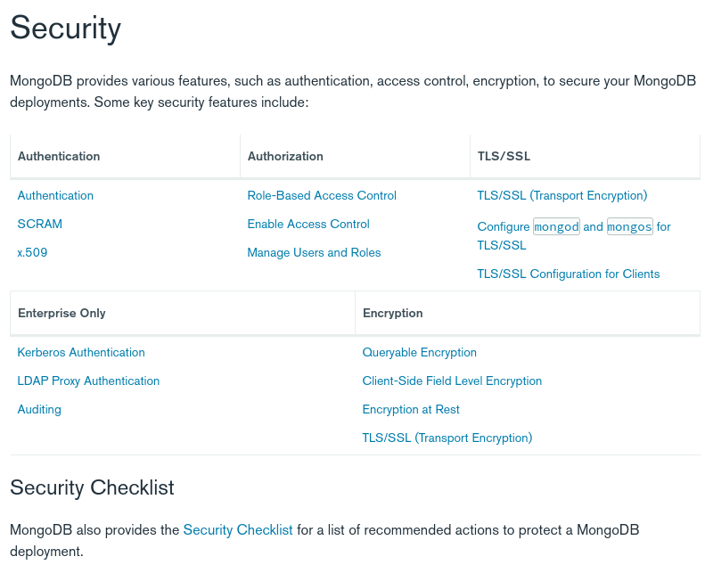

# MongoDB' de Rol Tabanlı Yetkilendirme (MongoDB Öğreniyoruz 9)

MongoDB resmi dokümanlarında [Security](https://www.mongodb.com/docs/manual/security/)  başlığını inceleyecek olursak rol tabanlı yetkilendirmeyi desteklediğini ve bunun da ücretsiz olduğunu görebiliriz. Enterprise lisans alırsak kerberos ve LDAP desteği ile birlikte auditing de geldiğini görebiliriz.




MongoDB ilk kurulduğunda built-in rollerle  geliyor. Biz de örneğin serinin  ikinci makalesinde admin kullanıcısı oluştururken belirli rolleri vermiştik. 

```javascript
db.createUser(
  {
    user: "adminuser",
    pwd: "Abc123",
    roles: [ { role: "userAdminAnyDatabase", db: "admin" }, 
             { role: "dbAdminAnyDatabase", db: "admin" }, 
             { role: "readWriteAnyDatabase", db: "admin" } ]
  }
)
```

Öncelikle built-in rolleri inceleyelim ardından kendi rollerimizi oluşturup kullanıcılara atayalım.


## Database Administrator Rolleri
- **dbAdmin**: Şemayla ilgili görevler, indeks oluşturma ve istatistik toplama gibi yönetim görevlerini gerçekleştirme yeteneği sağlar. Bu rol, kullanıcı ve rol yönetimi için yetki vermez.
- **userAdmin**: Geçerli veritabanında roller ve kullanıcılar oluşturma ve değiştirme yeteneği sağlar. userAdmin rolü, kullanıcıların kendileri de dahil olmak üzere herhangi bir kullanıcıya herhangi bir ayrıcalık vermesine izin verdiğinden, rol ayrıca dolaylı olarak veritabanına veya admin veritabanı kapsamına alınmışsa cluster'a süper kullanıcı erişimi sağlar.
- **dbOwner**: Veritabanı üzerinde herhangi bir yönetim eylemi gerçekleştirebilir. Bu rol, readWrite, dbAdmin ve userAdmin rolleri tarafından verilen yetkileri birleştirir.

## Cluster Admin Rolleri
- **clusterAdmin**: En büyük cluster yönetimi erişimini sağlar. Bu rol, clusterManager, clusterMonitor ve hostManager rolleri tarafından verilen yetkileri birleştirir. Ayrıca rol, dropDatabase yetkilerini de verir.
- **clusterManager**: Cluster üzerinde yönetim ve izleme yetkilerini verir. Bu role sahip bir kullanıcı, sırasıyla sharding ve replication kullanılan config ve local veritabanlarına erişebilir.
- **clusterMonitor**: MongoDB Cloud Manager ve Ops Manager gibi izleme araçlarına salt okunur erişim sağlar.
- **hostManager**: Sunucuları izleme ve yönetme yeteneği sağlar.

## Backup and Restoration Rollleri
- **backup**: Verileri yedeklemek için gereken minimum ayrıcalıkları sağlar. Bu rol, MongoDB Cloud Manager yedekleme aracısını, Ops Manager yedekleme aracısını kullanmak veya bir mongod örneğinin tamamını yedeklemek için mongodump kullanmak için yeterli yetkiler verir.
- **restore**: Verileri geri yüğklemek için gerekli yetkileri verir.

## All-Database Rolleri
- **readAnyDatabase**: local ve config dışındaki tüm veritabanlarında salt okuma yetkisi verir. Rol ayrıca cluster üzerinde listDatabases yetkisini de kullanabilir.
- **readWriteAnyDatabase**: local ve config dışındaki tüm veritabanlarında okuma ve yazma yetkisi verir.
- **userAdminAnyDatabase**: Local ve config dışındaki tüm veritabanlarında userAdmin ile aynı yetkileri verir.
- **dbAdminAnyDatabase**: Local ve config dışındaki tüm veritabanlarında dbAdmin ile aynı yetkileri verir.

## Superuser Rolleri
- **dbOwner**: dbOwner yetkisi admin veritabanını da kapsarsa super user rolü verilmş olur.
- **userAdmin**: userAdmin yetkisi admin veritabanını da kapsarsa super user rolü verilmş olur.
- **userAdminAnyDatabase**: Bütün vertabanlarında userAdmin yetkileri verir.

root rolğ en güçlü roldür ve alttaki yetkileri kapsar
- readWriteAnyDatabase
- dbAdminAnyDatabase
- userAdminAnyDatabase
- clusterAdmin
- restore
- backup

## Kullanıcı Tanımlı Roller

Kendi custom rollerimizi oluşturmak ve düzenlemek için alttaki fonksiyonları kullanırız.

- db.createRole():	Role yetkileri oluşturur
- db.updateRole():	Kullanıcı tanımlı rolleri düzenler
- db.dropRole():	Kullanıcı tanımlı rolleri siler
- db.grantPrivilegesToRole():	Kullanıcı tanımlı rollere yetki ekler
- db.revokePrivilegesFromRole():	Kullanıcı tanımlı rollerden yetki alır
- db.getRole(): Belirtilen rol hakkında bilgi verir


Diğer fonksiyonlar için resmi sitesindeki [şu sayfayı](https://www.mongodb.com/docs/manual/reference/method/#role-management) ziyaret ediniz.

- **Rol Oluşturma**


Taslak şu şekildedir

```javascript
{
  // rol adı
  role: "<name>",

  // kaynaklar yapılabilecek işlemler
  privileges: [
     { resource: { <resource> }, actions: [ "<action>", ... ] },
     ...
  ],

  // miras alınacak roller
  roles: [
     { role: "<role>", db: "<database>" } | "<role>",
      ...
  ],

  // hangi ip lerden gelen istekler değerlendirilecek
  authenticationRestrictions: [
    {
      clientSource: ["<IP>" | "<CIDR range>", ...],
      serverAddress: ["<IP>" | "<CIDR range>", ...]
    },
    ...
  ]
}

```

Örnek olarak aşağıda myClusterwideAdmin adında bir rol oluşturuluyor


```javascript

use admin
db.createRole(
   {
     role: "myClusterwideAdmin",
     privileges: [
       { resource: { cluster: true }, actions: [ "addShard" ] },
       { resource: { db: "config", collection: "" }, actions: [ "find", "update", "insert", "remove" ] },
       { resource: { db: "users", collection: "usersCollection" }, actions: [ "update", "insert", "remove" ] },
       { resource: { db: "", collection: "" }, actions: [ "find" ] }
     ],
     roles: [
       { role: "read", db: "admin" }
     ]
   },
   { w: "majority" , wtimeout: 5000 }
)

```

Örnekte görebileceğiniz üzere işin temelini privileges oluşturuyor. MongoDB'de bir çok action bulunuyor listesine [şu sayfadan](https://www.mongodb.com/docs/manual/reference/privilege-actions/) ulaşabilirsiniz. Resource için [şu sayfaya](https://www.mongodb.com/docs/manual/reference/resource-document/) bakabilirsiniz.

- **Rol Değiştirme**

Rol oluşturmaktan aslında bir farkı yok. Örnek kullanımı aşağıdaki örnek gibidir.

Update edilecek rolün adını yazmak yeterli.

```javascript
use products
db.updateRole(
    "inventoryControl",
    {
      privileges:
          [
            {
              resource: { db:"products", collection:"clothing" },
              actions: [ "update", "createCollection", "createIndex"]
            }
          ],
      roles:
          [
            {
              role: "read",
              db: "products"
            }
          ]
    },
    { w:"majority" }
)

```

- **Rol Hakkında Bilgi Almak**

kullanımı aşağıdaki gibidir.

```javascript

use products
db.getRole( "associate", { showPrivileges: true } )

```

## Kullanıcı Yönetimi


Öncelikle kendi kullanıcımızın detaylarına bakalım. Bunun için admin veritabanına geçiş yapmamız gerekiyor.

Hem kullanıcı adım hem de yetkileri root olarak görünüyor.


```javascript
use root
db.getUser("appClient")

// sonuç

// {
//   _id: 'admin.root',
//   userId: UUID("4e67b763-188c-45de-93f6-a0d39366736a"),
//   user: 'root',
//   db: 'admin',
//   roles: [ { role: 'root', db: 'admin' } ],
//   mechanisms: [ 'SCRAM-SHA-1', 'SCRAM-SHA-256' ]
// }

```

root rolü hakkında yukarıda konuşmuştuk. Her şeyi yapmaya yetkili rol.

Bir kullanıcı oluşturalım ve onun üzerinden çalışmaya devam edelim.


- **Kullanıcı oluşturma**


Hiçbir yetkisi olmayan kullanıcı oluşturmuş olduk.


```javascript

use admin
db.createUser( { user: "testuser",

                // veya  passwordPrompt() fonksiyonu ile kullanıcıya password oluşturma yapılabilir
                 pwd: "Abc123!",
                 roles:[]  
               } )
```

- **Şifre Değiştirme**

```javascript

db.changeUserPassword("testuser", "Abc-123!")

```

**Kullanıcıya Rol Atama**


# Kaynaklar
- https://www.mongodb.com/docs/manual/reference/built-in-roles/
- https://www.bmc.com/blogs/mongodb-role-based-access-control/
- https://www.digitalocean.com/community/tutorials/how-to-use-mongodb-access-control
- https://scalegrid.io/blog/mongodb-basics-configuring-role-based-access-control-rbac/
- https://www.mongodb.com/docs/manual/reference/resource-document/
- https://www.mongodb.com/docs/manual/reference/privilege-actions/
- https://www.mongodb.com/docs/manual/tutorial/manage-users-and-roles/